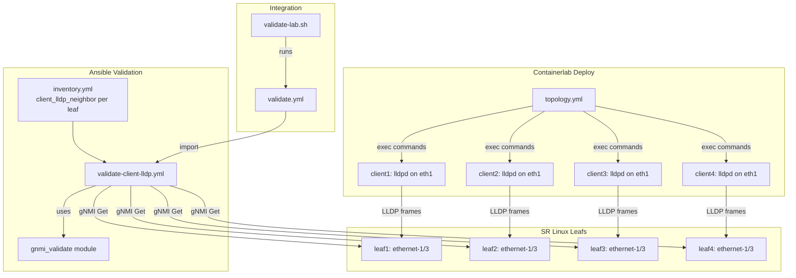

# Design Document: Client LLDP Validation

## Overview

This feature extends the containerlab topology and Ansible validation framework to include LLDP on Linux client containers. Currently, LLDP runs only between SR Linux switches (spine-leaf links). By installing and starting `lldpd` on each client container at deploy time, leaf switches will discover their connected clients as LLDP neighbors. A new validation playbook will use the existing `gnmi_validate` module to query each leaf's LLDP neighbor state on `ethernet-1/3` and assert the expected client system name.

The design touches four areas:
1. Topology file changes to install/start `lldpd` on client containers
2. Inventory data model for client-to-leaf LLDP neighbor expectations
3. A new Ansible playbook for client LLDP validation
4. Integration into the master validation playbook and validation script

All changes are additive. The existing `validate-lldp.yml` playbook remains untouched.

## Architecture

### Component Interaction



### Data Flow

1. `clab deploy` runs `topology.yml` → exec commands install `lldpd` and start it on each client
2. `lldpd` transmits LLDP frames on `eth1` → leaf receives on `ethernet-1/3`
3. Ansible playbook reads `client_lldp_neighbor` from inventory for each leaf host
4. `gnmi_validate` queries OpenConfig LLDP path on each leaf's `ethernet-1/3`
5. Playbook asserts the returned `system-name` matches the expected client name

## Components and Interfaces

### 1. Topology File Changes (`topology.yml`)

Each client node's `exec` block gains three commands prepended before the existing IP configuration:

```yaml
exec:
  - apk add --no-cache lldpd || true
  - lldpd -c -M 1
  - ip link set eth1 mtu 1400
  - ip addr add 10.10.100.1X/24 dev eth1
```

- `apk add --no-cache lldpd || true` — installs lldpd; `|| true` ensures the remaining exec commands run even if install fails (Requirement 1.4)
- `lldpd -c -M 1` — starts the daemon. `-c` reads the system hostname as the LLDP system name. `-M 1` sets the management address mode to use the first interface (eth1). The Alpine netshoot container hostname matches the containerlab node name (client1, client2, etc.), satisfying Requirement 1.3.

The `-c` flag is critical: it tells lldpd to use the container's hostname as the LLDP chassis system name, which containerlab sets to the node name.

### 2. Inventory Data Model (`ansible/group_vars/all.yml` or `ansible/inventory.yml`)

A new per-host variable `client_lldp_neighbor` is added to each leaf host in the inventory:

```yaml
leaf1:
  client_lldp_neighbor: "client1"
leaf2:
  client_lldp_neighbor: "client2"
# ...
```

This variable is only defined on leaf hosts (not spines), satisfying Requirement 2.3. The playbook uses `when: client_lldp_neighbor is defined` to skip hosts without it.

### 3. Validation Playbook (`ansible/playbooks/validate-client-lldp.yml`)

A new playbook targeting the `leafs` group that:

1. Calls `gnmi_validate` with:
   - `path`: `/lldp/interfaces/interface[name=ethernet-1/3]/neighbors/neighbor/state`
   - `origin`: `openconfig`
   - `check_name`: `client_lldp_neighbor`
   - `expected`: `{ system-name: "{{ client_lldp_neighbor }}" }`
   - `remediation_hint`: contextual message about lldpd not running
2. Registers the result and asserts `status == 'pass'`
3. Provides distinct failure messages for:
   - No LLDP neighbor data (lldpd may not be running)
   - System name mismatch (wrong client connected)

The playbook is tagged `client-lldp` for selective execution.

### 4. Master Playbook Integration (`ansible/playbooks/validate.yml`)

A new import entry:

```yaml
- name: Validate client LLDP neighbors
  ansible.builtin.import_playbook: validate-client-lldp.yml
  tags:
    - client-lldp
```

### 5. Validation Script Integration (`scripts/validate-lab.sh`)

No changes needed. The script already runs `ansible-playbook validate.yml` which will pick up the new import. The client LLDP validation runs as part of the configuration validation phase automatically.

## Data Models

### Inventory Variable: `client_lldp_neighbor`

| Field | Type | Location | Description |
|-------|------|----------|-------------|
| `client_lldp_neighbor` | string | Per leaf host in `ansible/inventory.yml` | Expected LLDP system name of the client connected to ethernet-1/3 |

Mapping:
- `leaf1.client_lldp_neighbor` = `"client1"`
- `leaf2.client_lldp_neighbor` = `"client2"`
- `leaf3.client_lldp_neighbor` = `"client3"`
- `leaf4.client_lldp_neighbor` = `"client4"`

Not defined on spine hosts.

### gNMI Query Path

```
origin: openconfig
path: /lldp/interfaces/interface[name=ethernet-1/3]/neighbors/neighbor/state
```

Expected response structure (relevant fields):
```json
{
  "openconfig-lldp:state": {
    "system-name": "client1",
    "port-id": "eth1",
    "chassis-id": "..."
  }
}
```

### gnmi_validate Module Invocation

```yaml
gnmi_validate:
  host: "{{ ansible_host }}"
  port: "{{ gnmi_port }}"
  username: "{{ gnmi_username }}"
  password: "{{ gnmi_password }}"
  skip_verify: "{{ gnmi_skip_verify | default(true) }}"
  check_name: "client_lldp_neighbor"
  path: "/lldp/interfaces/interface[name=ethernet-1/3]/neighbors/neighbor/state"
  origin: "openconfig"
  expected:
    system-name: "{{ client_lldp_neighbor }}"
  remediation_hint: >-
    Expected LLDP neighbor '{{ client_lldp_neighbor }}' on ethernet-1/3.
    Verify lldpd is running on the client container:
    docker exec clab-gnmi-clos-{{ client_lldp_neighbor }} pgrep lldpd
```


## Correctness Properties

*A property is a characteristic or behavior that should hold true across all valid executions of a system — essentially, a formal statement about what the system should do. Properties serve as the bridge between human-readable specifications and machine-verifiable correctness guarantees.*

### Property 1: Topology exec completeness

*For any* client node defined in the topology file, the node's exec block must contain an `lldpd` install command (with `|| true` for fault tolerance) and a daemon start command, ensuring LLDP is provisioned on every client at deploy time.

**Validates: Requirements 1.1, 1.3, 1.4**

### Property 2: Leaf inventory LLDP neighbor completeness

*For any* host in the `leafs` group of the Ansible inventory, the host must have a `client_lldp_neighbor` variable defined with a non-empty string value.

**Validates: Requirements 2.1**

### Property 3: Spine inventory LLDP neighbor exclusion

*For any* host in the `spines` group of the Ansible inventory, the host must not have a `client_lldp_neighbor` variable defined.

**Validates: Requirements 2.3**

### Property 4: System name comparison correctness

*For any* two strings `expected` and `actual`, calling `semantic_compare({"system-name": expected}, {"system-name": actual})` returns an empty diff list if and only if `expected == actual`. When they differ, the diff list must contain an entry with the expected and actual values.

**Validates: Requirements 3.2, 3.4**

## Error Handling

### Topology Deployment Errors

| Scenario | Handling | Requirement |
|----------|----------|-------------|
| `apk add lldpd` fails (network issue, package unavailable) | `|| true` ensures remaining exec commands (MTU, IP) still run | 1.4 |
| `lldpd` fails to start | Container still functions for IP connectivity; LLDP validation will catch the missing neighbor | 1.2 |

### Validation Playbook Errors

| Scenario | Handling | Requirement |
|----------|----------|-------------|
| gNMI connection failure to leaf | `gnmi_validate` module fails with connection error message; playbook reports device unreachable | 3.1 |
| No LLDP neighbor on ethernet-1/3 | `gnmi_validate` returns empty actual data; playbook assert fails with remediation hint about lldpd not running | 3.3 |
| Wrong LLDP neighbor system name | `gnmi_validate` returns diffs with expected vs actual; playbook assert fails showing both values | 3.4 |
| `client_lldp_neighbor` not defined on host | Playbook task uses `when: client_lldp_neighbor is defined` to skip; this naturally excludes spines | 3.6 |

### Remediation Hints

The playbook provides actionable remediation for each failure mode:
- Missing neighbor: "Verify lldpd is running on the client container: `docker exec clab-gnmi-clos-<client> pgrep lldpd`"
- Wrong neighbor: The gnmi_validate module's diff output shows expected vs actual system names

## Testing Strategy

### Unit Tests

Unit tests verify specific examples and edge cases:

1. **Topology YAML structure** — Parse `topology.yml` and verify each client node (client1–client4) has the expected exec commands in the correct order
2. **Inventory mappings** — Parse `ansible/inventory.yml` and verify leaf1→client1, leaf2→client2, leaf3→client3, leaf4→client4 mappings exist and spines have no such mapping
3. **Playbook structure** — Parse `validate-client-lldp.yml` and verify it targets `leafs`, uses `gnmi_validate`, has the `client-lldp` tag, and references the correct gNMI path
4. **Master playbook integration** — Parse `validate.yml` and verify it imports `validate-client-lldp.yml` with the `client-lldp` tag
5. **Check name uniqueness** — Verify `client_lldp_neighbor` check name differs from existing `lldp_neighbors` check name

### Property-Based Tests

Property-based tests verify universal properties across generated inputs. Use `hypothesis` (Python) as the PBT library. Each test runs a minimum of 100 iterations.

1. **Feature: client-lldp-validation, Property 1: Topology exec completeness** — Generate random sets of client node names and verify the topology structure invariant holds for all of them
2. **Feature: client-lldp-validation, Property 2: Leaf inventory LLDP neighbor completeness** — Generate random leaf host entries and verify each has a non-empty `client_lldp_neighbor`
3. **Feature: client-lldp-validation, Property 3: Spine inventory LLDP neighbor exclusion** — Generate random spine host entries and verify none have `client_lldp_neighbor`
4. **Feature: client-lldp-validation, Property 4: System name comparison correctness** — Generate random pairs of strings and verify `semantic_compare` returns empty diffs iff the strings are equal, and non-empty diffs with expected/actual values when they differ

### Integration Tests

Integration tests require a running containerlab topology and are run via the validation playbook itself:

- Deploy topology with `clab deploy`
- Wait 30 seconds for LLDP convergence
- Run `ansible-playbook validate.yml --tags client-lldp` and verify all checks pass
- These are covered by the existing `validate-lab.sh` script workflow
