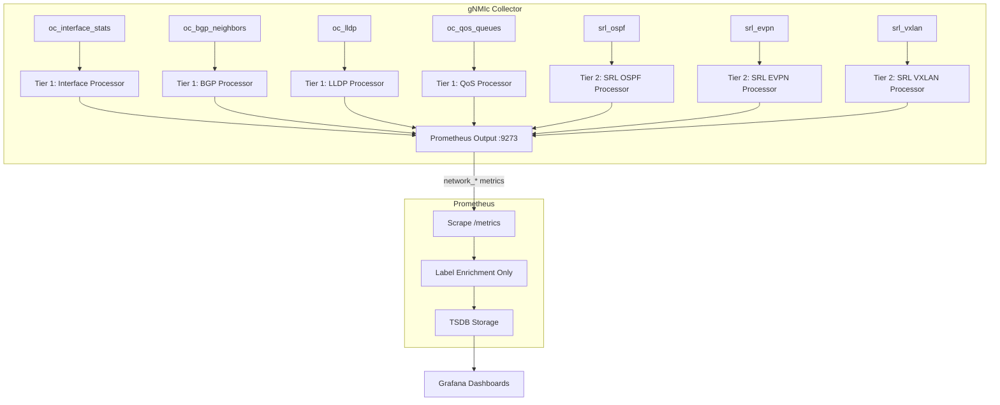

# Design Document: gNMIc Metric Normalization

## Overview

This design moves metric name normalization from ~50 Prometheus `metric_relabel_configs` regex rules (~300 lines of YAML) into gNMIc event processors. The result is that gNMIc exports metrics with clean `network_*` names directly, Prometheus config shrinks to label enrichment only, and adding new vendors requires only a new processor chain without touching existing config.

The normalization engine is organized in two tiers:

- **Tier 1 (OpenConfig):** Uses `event-strings` processors with regex `replace` operations on event names to strip the verbose auto-generated gNMIc prefix (e.g., `gnmic_oc_interface_stats_openconfig_interfaces_interfaces_interface_state_counters_in_octets`) down to the normalized name (`network_interface_in_octets`). These processors apply to the 4 OpenConfig subscriptions: `oc_interface_stats`, `oc_bgp_neighbors`, `oc_lldp`, `oc_qos_queues`.

- **Tier 2 (Native):** Uses `event-strings` processors with regex `replace` operations to map vendor-specific auto-generated names (e.g., `gnmic_srl_ospf_srl_nokia_network_instance_...`) to the same `network_*` namespace. Additionally uses `event-add-tag` to inject `vendor=nokia`. These processors apply to the 3 SR Linux native subscriptions: `srl_ospf`, `srl_evpn`, `srl_vxlan`.

All processors are wired to the Prometheus output via the `event-processors` key. Subscriptions remain unchanged.

## Architecture



### Design Decisions

1. **Processors on the output, not per-subscription.** gNMIc applies `event-processors` listed on the output to all events flowing through that output. Each processor uses regex matching on the event name to selectively act on its target subscription's events. This avoids duplicating processor references across subscriptions.

2. **`event-strings` with `replace` for name rewriting.** The `event-strings` processor's `replace` transform with `apply-on: "name"` is the idiomatic gNMIc way to rename metrics. Each processor chain uses a series of `replace` operations, one per metric mapping.

3. **Tier 2 processors add `vendor` tag.** Tier 1 (OpenConfig) metrics don't get a vendor tag from gNMIc because they're vendor-neutral. Prometheus label enrichment adds `vendor=nokia` to all scraped metrics. Tier 2 processors add `vendor=nokia` via `event-add-tag` so the label is present regardless of the Prometheus config.

4. **Passthrough for unmatched events.** gNMIc event processors only modify events that match their regex conditions. Events that don't match any `replace` pattern pass through with their original auto-generated name. This satisfies the "pass through unchanged" requirement naturally.

5. **Processor ordering.** Processors listed in the output's `event-processors` array execute in order. Tier 1 processors are listed first, then Tier 2. Since each processor targets a different subscription prefix, ordering doesn't affect correctness, but the convention makes the config readable.

## Components and Interfaces

### Component 1: Tier 1 OpenConfig Processors

Four `event-strings` processor definitions in `gnmic-config.yml`:

| Processor Name | Subscription Target | Output Prefix |
|---|---|---|
| `normalize-oc-interfaces` | `gnmic_oc_interface_stats_*` | `network_interface_*` |
| `normalize-oc-bgp` | `gnmic_oc_bgp_neighbors_*` | `network_bgp_*` |
| `normalize-oc-lldp` | `gnmic_oc_lldp_*` | `network_lldp_*` |
| `normalize-oc-qos` | `gnmic_oc_qos_queues_*` | `network_qos_*` |

Each processor contains a list of `replace` transforms with:
- `apply-on: "name"` — operates on the metric name
- `old` — regex matching the auto-generated gNMIc metric name
- `new` — the normalized `network_*` name

Example for interface in_octets:
```yaml
processors:
  normalize-oc-interfaces:
    event-strings:
      value-names:
        - ".*"
      transforms:
        - replace:
            apply-on: "name"
            old: "gnmic_oc_interface_stats_openconfig_interfaces_interfaces_interface_state_counters_in_octets"
            new: "network_interface_in_octets"
        # ... additional replace transforms for each counter
```

### Component 2: Tier 2 SR Linux Native Processors

Three `event-strings` processor definitions, each paired with an `event-add-tag`:

| Processor Name | Subscription Target | Output Prefix |
|---|---|---|
| `normalize-srl-ospf` | `gnmic_srl_ospf_*` | `network_ospf_*` |
| `normalize-srl-evpn` | `gnmic_srl_evpn_*` | `network_evpn_*` |
| `normalize-srl-vxlan` | `gnmic_srl_vxlan_*` | `network_vxlan_*` |

Each Tier 2 processor also includes an `event-add-tag` to inject `vendor: nokia`:
```yaml
processors:
  normalize-srl-ospf:
    event-strings:
      value-names:
        - ".*"
      transforms:
        - replace:
            apply-on: "name"
            old: "gnmic_srl_ospf_srl_nokia_network_instance_network_instance_protocols_srl_nokia_ospf_ospf_instance_area_interface_neighbor_adjacency_state"
            new: "network_ospf_neighbor_state"
        # ... additional replace transforms
  
  tag-srl-ospf:
    event-add-tag:
      condition:
        value-names:
          - "^network_ospf_.*"
      add:
        vendor: nokia
```

### Component 3: Prometheus Output Integration

The existing `prom` output in `gnmic-config.yml` gains an `event-processors` list:

```yaml
outputs:
  prom:
    type: prometheus
    listen: :9273
    path: /metrics
    metric-prefix: gnmic
    append-subscription-name: true
    export-timestamps: true
    strings-as-labels: true
    event-processors:
      # Tier 1: OpenConfig
      - normalize-oc-interfaces
      - normalize-oc-bgp
      - normalize-oc-lldp
      - normalize-oc-qos
      # Tier 2: SR Linux native
      - normalize-srl-ospf
      - tag-srl-ospf
      - normalize-srl-evpn
      - tag-srl-evpn
      - normalize-srl-vxlan
      - tag-srl-vxlan
```

### Component 4: Reduced Prometheus Relabeling

The `metric_relabel_configs` in `prometheus.yml` is reduced from ~50 rules to ~12 rules:

**Retained rules (label enrichment only):**
- `vendor=nokia` static label (for all metrics including Tier 1)
- `role` derivation from `source` (spine/leaf regex)
- `interface_normalized` derivation from `interface_name` (vendor-specific interface name patterns)
- `topology` and `fabric_type` labels

**Removed rules:**
- All `__name__` regex replacement rules (Steps 5-8 in current config)

### Component 5: Mapping File

`normalization-mappings.yml` remains the source of truth. No structural changes needed — it already documents all path-to-metric-name mappings. The gNMIc processor `replace` patterns are derived directly from this file.

## Data Models

### gNMIc Event Model (internal)

gNMIc events flow through processors with this structure:

```
Event {
  name: string        // metric name (e.g., "gnmic_oc_interface_stats_..._in_octets")
  timestamp: int64    // nanosecond timestamp
  tags: map[string]string  // labels (source, interface_name, etc.)
  values: map[string]any   // metric values
}
```

After Tier 1 processing:
```
Event {
  name: "network_interface_in_octets"
  tags: { source: "spine1", interface_name: "ethernet-1/1", subscription-name: "oc_interface_stats" }
  values: { "network_interface_in_octets": 123456 }
}
```

After Tier 2 processing:
```
Event {
  name: "network_ospf_neighbor_state"
  tags: { source: "spine1", network_instance_name: "default", area_id: "0.0.0.0", vendor: "nokia" }
  values: { "network_ospf_neighbor_state": "FULL" }
}
```

### Normalized Metric Names (complete list)

| Category | Normalized Metric Name | Source Subscription |
|---|---|---|
| Interface | `network_interface_in_octets` | `oc_interface_stats` |
| Interface | `network_interface_out_octets` | `oc_interface_stats` |
| Interface | `network_interface_in_packets` | `oc_interface_stats` |
| Interface | `network_interface_out_packets` | `oc_interface_stats` |
| Interface | `network_interface_in_errors` | `oc_interface_stats` |
| Interface | `network_interface_out_errors` | `oc_interface_stats` |
| Interface | `network_interface_in_discards` | `oc_interface_stats` |
| Interface | `network_interface_out_discards` | `oc_interface_stats` |
| Interface | `network_interface_in_unicast_packets` | `oc_interface_stats` |
| Interface | `network_interface_out_unicast_packets` | `oc_interface_stats` |
| Interface | `network_interface_in_broadcast_packets` | `oc_interface_stats` |
| Interface | `network_interface_out_broadcast_packets` | `oc_interface_stats` |
| Interface | `network_interface_in_multicast_packets` | `oc_interface_stats` |
| Interface | `network_interface_out_multicast_packets` | `oc_interface_stats` |
| Interface | `network_interface_carrier_transitions` | `oc_interface_stats` |
| Interface | `network_interface_in_fcs_errors` | `oc_interface_stats` |
| Interface | `network_interface_oper_status` | `oc_interface_stats` |
| Interface | `network_interface_admin_status` | `oc_interface_stats` |
| BGP | `network_bgp_session_state` | `oc_bgp_neighbors` |
| BGP | `network_bgp_established_transitions` | `oc_bgp_neighbors` |
| BGP | `network_bgp_last_established` | `oc_bgp_neighbors` |
| BGP | `network_bgp_peer_as` | `oc_bgp_neighbors` |
| BGP | `network_bgp_local_as` | `oc_bgp_neighbors` |
| BGP | `network_bgp_enabled` | `oc_bgp_neighbors` |
| BGP | `network_bgp_neighbor_address` | `oc_bgp_neighbors` |
| BGP | `network_bgp_peer_group` | `oc_bgp_neighbors` |
| BGP | `network_bgp_peer_type` | `oc_bgp_neighbors` |
| BGP | `network_bgp_queues_input` | `oc_bgp_neighbors` |
| BGP | `network_bgp_queues_output` | `oc_bgp_neighbors` |
| BGP | `network_bgp_messages_received_update` | `oc_bgp_neighbors` |
| BGP | `network_bgp_messages_sent_update` | `oc_bgp_neighbors` |
| BGP | `network_bgp_messages_received_notification` | `oc_bgp_neighbors` |
| BGP | `network_bgp_messages_sent_notification` | `oc_bgp_neighbors` |
| BGP | `network_bgp_remove_private_as` | `oc_bgp_neighbors` |
| BGP | `network_bgp_supported_capabilities` | `oc_bgp_neighbors` |
| BGP | `network_bgp_last_notification_received` | `oc_bgp_neighbors` |
| BGP | `network_bgp_last_notification_sent` | `oc_bgp_neighbors` |
| LLDP | `network_lldp_neighbor_system_name` | `oc_lldp` |
| LLDP | `network_lldp_neighbor_port_id` | `oc_lldp` |
| LLDP | `network_lldp_neighbor_chassis_id` | `oc_lldp` |
| LLDP | `network_lldp_neighbor_port_description` | `oc_lldp` |
| LLDP | `network_lldp_neighbor_system_description` | `oc_lldp` |
| LLDP | `network_lldp_neighbor_chassis_id_type` | `oc_lldp` |
| LLDP | `network_lldp_neighbor_port_id_type` | `oc_lldp` |
| LLDP | `network_lldp_neighbor_age` | `oc_lldp` |
| LLDP | `network_lldp_neighbor_last_update` | `oc_lldp` |
| LLDP | `network_lldp_neighbor_id` | `oc_lldp` |
| QoS | `network_qos_transmit_packets` | `oc_qos_queues` |
| QoS | `network_qos_transmit_octets` | `oc_qos_queues` |
| QoS | `network_qos_dropped_packets` | `oc_qos_queues` |
| QoS | `network_qos_dropped_octets` | `oc_qos_queues` |
| QoS | `network_qos_max_queue_length` | `oc_qos_queues` |
| QoS | `network_qos_queue_name` | `oc_qos_queues` |
| QoS | `network_qos_queue_management_profile` | `oc_qos_queues` |
| OSPF | `network_ospf_neighbor_state` | `srl_ospf` |
| OSPF | `network_ospf_retransmission_queue_length` | `srl_ospf` |
| EVPN | `network_evpn_oper_state` | `srl_evpn` |
| EVPN | `network_evpn_evi` | `srl_evpn` |
| EVPN | `network_evpn_ecmp` | `srl_evpn` |
| VXLAN | `network_vxlan_oper_state` | `srl_vxlan` |
| VXLAN | `network_vxlan_index` | `srl_vxlan` |
| VXLAN | `network_vxlan_bridge_active_entries` | `srl_vxlan` |
| VXLAN | `network_vxlan_bridge_total_entries` | `srl_vxlan` |
| VXLAN | `network_vxlan_bridge_failed_entries` | `srl_vxlan` |
| VXLAN | `network_vxlan_multicast_limit` | `srl_vxlan` |

### Label Dimensions

Labels preserved through normalization (required by dashboards):

| Label | Source | Used By |
|---|---|---|
| `source` | gNMIc target name | All dashboards (device selector) |
| `interface_name` | gNMIc path key | Interface, QoS dashboards |
| `neighbor_address` | gNMIc path key | BGP dashboards |
| `network_instance_name` | gNMIc path key | BGP, OSPF, EVPN dashboards |
| `area_id` / `area_area_id` | gNMIc path key | OSPF dashboards |
| `queue_name` | gNMIc path key | QoS dashboards |
| `vxlan_interface_index` | gNMIc path key | VXLAN dashboards |
| `subscription-name` | gNMIc auto-label | Debugging |
| `vendor` | Tier 2 tag / Prometheus enrichment | Universal dashboards |
| `role` | Prometheus enrichment | Universal dashboards |
| `interface_normalized` | Prometheus enrichment | Universal dashboards |
| `topology` | Prometheus enrichment | Universal dashboards |
| `fabric_type` | Prometheus enrichment | Universal dashboards |

## Correctness Properties

*A property is a characteristic or behavior that should hold true across all valid executions of a system — essentially, a formal statement about what the system should do. Properties serve as the bridge between human-readable specifications and machine-verifiable correctness guarantees.*

### Property 1: Mapping correctness

*For any* mapping entry in the normalization-mappings.yml file that has a defined `normalized` output name, the corresponding gNMIc processor `replace` transform shall convert the auto-generated gNMIc metric name to exactly that normalized name. Specifically, for any (input_name, expected_output_name) pair derived from the mapping file, applying the processor's regex replace to input_name shall produce expected_output_name.

**Validates: Requirements 1.1, 1.2, 2.1, 3.1, 4.1, 5.1, 5.2, 6.1, 6.2, 6.3, 7.1, 7.2, 7.3, 7.4, 10.1**

### Property 2: Label preservation

*For any* gNMIc event with an arbitrary set of tags (labels), after processing through any normalization processor (Tier 1 or Tier 2), all original tag keys and values shall be present in the output event. The processor may add new tags (e.g., `vendor`) but shall never remove or modify existing tags.

**Validates: Requirements 1.3, 2.2, 2.3, 3.2, 4.2, 5.4, 6.5, 7.6, 10.2**

### Property 3: Passthrough for unmatched events

*For any* gNMIc event whose metric name does not match any `replace` pattern in any normalization processor, the output event name shall be identical to the input event name. No fields of the event shall be modified.

**Validates: Requirements 1.4, 2.4, 3.3, 4.3, 5.5, 6.6, 7.7, 9.5**

### Property 4: Vendor tag injection for Tier 2

*For any* event processed by a Tier 2 SR Linux processor (OSPF, EVPN, or VXLAN) whose name matches a Tier 2 mapping, the output event shall contain the tag `vendor=nokia` in addition to all original tags.

**Validates: Requirements 5.3, 6.4, 7.5**

### Property 5: No metric name rewriting in Prometheus config

*For any* rule in the updated `metric_relabel_configs` section of `prometheus.yml`, the `target_label` field shall not equal `__name__`. All `__name__` regex replacement rules shall have been removed.

**Validates: Requirements 8.5**

### Property 6: Subscriptions unchanged

*For any* subscription defined in `gnmic-config.yml`, the `paths`, `mode`, `stream-mode`, and `sample-interval` fields shall be identical before and after adding the normalization processors. The processor addition shall only modify the `outputs` section.

**Validates: Requirements 9.3**

### Property 7: Dashboard metric coverage

*For any* `network_*` metric name referenced in a Grafana dashboard JSON file (extracted from `expr` fields), there shall exist a corresponding processor `replace` transform in the gNMIc config that produces that exact metric name.

**Validates: Requirements 10.3**

### Property 8: Mapping file completeness

*For any* `replace` transform in the gNMIc processor configuration that maps an input name to a `network_*` output name, there shall exist a corresponding entry in `normalization-mappings.yml` that documents that same mapping.

**Validates: Requirements 12.1, 12.2**

## Error Handling

### gNMIc Processor Errors

- **Malformed regex in processor config:** gNMIc validates processor config at startup. A bad regex will prevent gNMIc from starting, which is the desired fail-fast behavior. The CI pipeline should validate gNMIc config syntax before deployment.
- **Processor chain failure:** If a processor encounters an unexpected event structure, gNMIc logs the error and passes the event through unmodified. This is the default gNMIc behavior and satisfies the passthrough requirement.
- **Duplicate metric names:** If two different auto-generated names accidentally map to the same normalized name, Prometheus will merge them. The mapping file review process should catch this. The CI validation script should check for duplicate output names.

### Prometheus Scrape Errors

- **Missing metrics after migration:** If a processor regex doesn't match (e.g., gNMIc changes its auto-naming scheme in an upgrade), the metric will appear with its raw auto-generated name instead of the normalized name. Dashboards will show "no data" for the normalized name. A CI test should verify that all expected normalized names are produced.
- **Label conflicts:** If a Tier 2 `event-add-tag` adds a `vendor` label that already exists on the event, gNMIc's `event-add-tag` overwrites the existing value. Since Tier 1 events don't have a vendor tag from gNMIc, and Tier 2 events are vendor-specific, this is the correct behavior.

### Migration Rollback

- **Rollback strategy:** Keep the old `prometheus.yml` with `__name__` rules in version control. If the gNMIc processors produce incorrect names, revert the Prometheus config to restore the old relabeling rules while debugging the processors. Both approaches can coexist temporarily since Prometheus relabeling runs after gNMIc export.

## Testing Strategy

### Unit Tests (Example-Based)

Unit tests verify specific concrete mappings and config structure:

1. **Config structure validation:** Parse `gnmic-config.yml` and verify:
   - The `outputs.prom.event-processors` list contains all expected processor names
   - Each processor is defined in the `processors` section
   - Tier 1 processors are listed before Tier 2 processors (Req 9.4)

2. **Prometheus config validation:** Parse `prometheus.yml` and verify:
   - No `target_label: __name__` rules exist (Req 8.5)
   - `vendor`, `role`, `interface_normalized`, `topology`, `fabric_type` enrichment rules are present (Req 8.1-8.4)
   - Total rule count is under 20 (Req 8.6)

3. **Specific mapping spot-checks:** Verify a few representative mappings end-to-end:
   - `gnmic_oc_interface_stats_..._in_octets` → `network_interface_in_octets`
   - `gnmic_srl_ospf_..._adjacency_state` → `network_ospf_neighbor_state`

4. **Vendor extensibility structure:** Verify Tier 2 processors follow the `normalize-srl-*` / `tag-srl-*` naming convention (Req 11.1)

### Property-Based Tests

Property-based tests use a PBT library (e.g., `hypothesis` for Python or `fast-check` for TypeScript) to verify universal properties across generated inputs. Each test runs a minimum of 100 iterations.

Since gNMIc processors are YAML configuration (not application code), the property tests operate on the configuration files themselves — parsing the YAML and verifying structural properties. A Python validation script with `hypothesis` is the recommended approach since the project already uses `uv` for Python tooling.

1. **Property 1 test:** Generate random (input_name, expected_output) pairs from the mapping file. For each pair, verify the corresponding processor `replace` entry exists with matching `old`/`new` values.
   - Tag: `Feature: gnmic-metric-normalization, Property 1: Mapping correctness`

2. **Property 3 test:** Generate random metric names that don't match any processor `old` pattern. Verify none of the processor regexes match.
   - Tag: `Feature: gnmic-metric-normalization, Property 3: Passthrough for unmatched events`

3. **Property 5 test:** Parse all rules in `metric_relabel_configs`. For each rule, verify `target_label != "__name__"`.
   - Tag: `Feature: gnmic-metric-normalization, Property 5: No metric name rewriting in Prometheus config`

4. **Property 6 test:** Parse both old and new `gnmic-config.yml` subscription sections. For any subscription key, verify all fields except `outputs` and `processors` are identical.
   - Tag: `Feature: gnmic-metric-normalization, Property 6: Subscriptions unchanged`

5. **Property 7 test:** Extract all `network_*` metric names from dashboard JSON `expr` fields. For each name, verify a processor `replace` with that `new` value exists in the gNMIc config.
   - Tag: `Feature: gnmic-metric-normalization, Property 7: Dashboard metric coverage`

6. **Property 8 test:** Extract all `replace` transforms from gNMIc processors. For each transform's `new` value (the normalized name), verify a corresponding entry exists in `normalization-mappings.yml`.
   - Tag: `Feature: gnmic-metric-normalization, Property 8: Mapping file completeness`

Properties 2 and 4 (label preservation and vendor tag injection) are inherent behaviors of gNMIc's `event-strings` and `event-add-tag` processors — they don't remove labels by design. These are validated through integration testing by inspecting the actual `/metrics` endpoint output after deploying the config to the lab.

### Integration Tests

After deploying the updated configs to the containerlab environment:

1. Scrape `http://clab-monitoring-gnmic:9273/metrics` and verify `network_*` metric names appear
2. Query Prometheus for each normalized metric and verify labels are present
3. Verify Grafana dashboards render without errors
