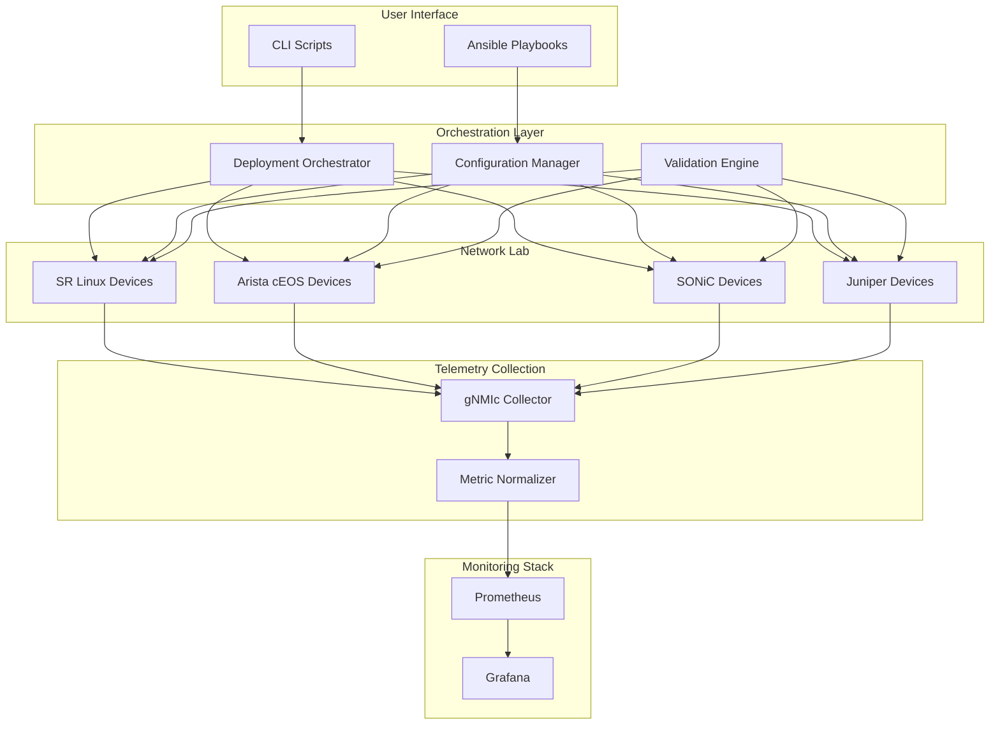
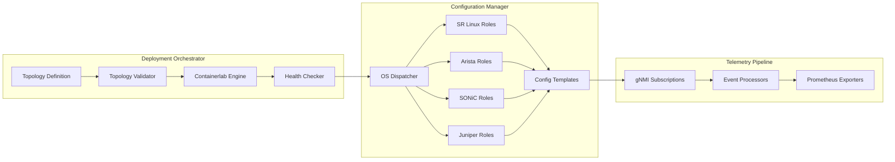
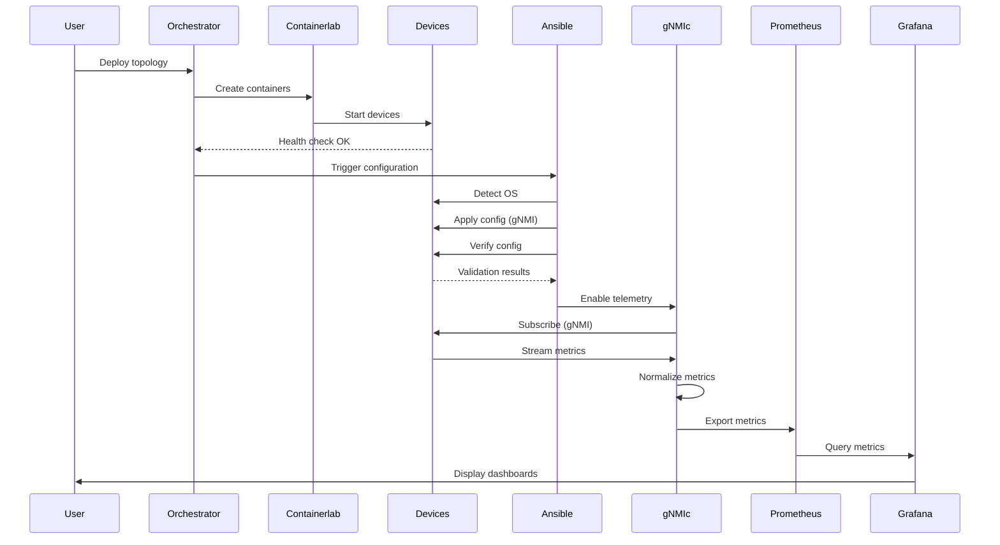
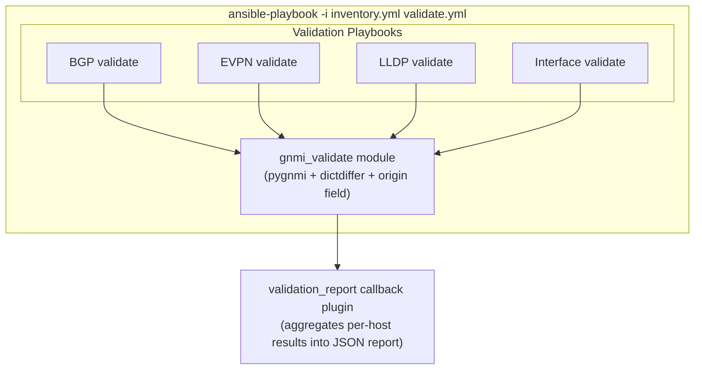

# Design Document: Production Network Testing Lab

## Overview

The Production Network Testing Lab is a comprehensive multi-vendor network testing environment that enables engineers to deploy, configure, and monitor production-grade network topologies using containerized network operating systems. The lab provides vendor-agnostic automation, telemetry collection, and monitoring capabilities while supporting vendor-specific features when needed.

### Key Capabilities

- **Multi-Vendor Support**: SR Linux, Arista cEOS, SONiC, and Juniper devices in unified topologies
- **Automated Deployment**: Single-command topology deployment with validation
- **Production Configurations**: EVPN/VXLAN fabrics, iBGP with route reflectors, OSPF underlay
- **Vendor-Agnostic Telemetry**: OpenConfig-based metrics normalized across vendors
- **Hybrid Telemetry**: Native vendor metrics when OpenConfig is insufficient
- **Universal Monitoring**: Grafana dashboards that work across all vendors
- **Infrastructure as Code**: All configurations managed via Ansible with version control
- **State Management**: Export/restore lab states for reproducibility

### Design Philosophy

The lab follows a "vendor-agnostic by default, vendor-specific when necessary" approach:

1. **OpenConfig First**: Use OpenConfig models for telemetry where vendor support exists
2. **Native Fallback**: Use native vendor models when OpenConfig is incomplete
3. **Metric Normalization**: Transform all metrics to universal paths for unified queries
4. **Dispatcher Pattern**: Detect device OS and route to appropriate configuration method
5. **Idempotent Operations**: All configuration operations can be safely repeated
6. **Separation of Concerns**: Network lab, monitoring stack, and automation are independently deployable

### Current Implementation Status

**Implemented Components:**
- ✅ Containerlab topology deployment (SR Linux)
- ✅ Ansible automation framework with dispatcher pattern
- ✅ Multi-vendor role templates (SR Linux, Arista, SONiC)
- ✅ gNMI-based configuration (SR Linux native paths)
- ✅ OpenConfig telemetry collection (interfaces, BGP, LLDP)
- ✅ Hybrid telemetry (OpenConfig + native SR Linux)
- ✅ gNMIc telemetry collector with Prometheus export
- ✅ Metric normalization via gNMIc processors
- ✅ Grafana dashboards (BGP, OSPF, interfaces)
- ✅ Interface name translation filters
- ✅ Configuration verification playbooks

**Needs Implementation:**
- ⚠️ Multi-vendor topology deployment (Arista, SONiC, Juniper)
- ⚠️ EVPN/VXLAN configuration roles
- ⚠️ Automated validation framework
- ⚠️ Performance benchmarking tools
- ⚠️ Lab state management (export/restore)
- ⚠️ Vendor extension framework
- ⚠️ Configuration parsing and validation
- ⚠️ Comprehensive test suite

### Production Datacenter Compatibility

**Critical Design Principle**: All components are designed for direct production use. The lab is not a simulation—it's a production operations platform running on containerized hardware.

**Lab vs Production Differences**:
- **Lab**: Containerized network devices (clab-*)
- **Production**: Physical switches or VMs
- **Everything Else**: Identical (same Ansible code, same dashboards, same queries, same validation)

**Portability Guarantees**:

1. **Ansible Automation**: Same playbooks and roles work in both environments
   - OS detection works on containers, VMs, and physical devices
   - Configuration templates are hardware-agnostic
   - Only inventory file changes (IP addresses, credentials)
   - No lab-specific conditionals in roles

2. **Telemetry Collection**: Identical gNMI subscriptions and normalization
   - Same gNMIc configuration file
   - Same OpenConfig paths
   - Same metric normalization rules
   - Only target addresses change in configuration

3. **Monitoring Stack**: Identical dashboards and queries
   - Same Grafana dashboards
   - Same Prometheus queries
   - Same alerting rules
   - Dashboards use device labels, not hardcoded names

4. **Validation Framework**: Same checks for lab and production
   - BGP session validation
   - LLDP topology verification
   - Interface state checks
   - Configuration compliance validation

5. **Deployment Patterns**: Production-ready rollout strategies
   - Canary deployments (test on one device first)
   - Blue-green deployments (parallel environments)
   - Gradual rollout with validation gates
   - Rollback procedures on failure

**Migration Path**:
1. Develop and test configuration in lab
2. Validate with automated checks
3. Update production inventory (device IPs/credentials)
4. Run same Ansible playbook against production
5. Monitor with same Grafana dashboards

**Scale Considerations**:
- Lab: 10-20 devices, ~1000 metrics per device
- Production: 1000+ devices, 10,000+ metrics per device
- Prometheus and Grafana scale to production volumes
- gNMIc supports horizontal scaling (multiple collectors)

## Architecture

### High-Level Architecture



### Component Architecture



### Data Flow Architecture



## Components and Interfaces

### 1. Deployment Orchestrator

**Purpose**: Manages topology lifecycle (deploy, validate, destroy)

**Implementation**: Shell scripts wrapping Containerlab CLI

**Key Files**:
- `deploy.sh` - Deploy topology
- `destroy.sh` - Destroy topology
- `topology.yml` - Topology definition (Containerlab format)

**Interfaces**:

```yaml
# Input: Topology Definition (YAML)
name: production-lab
topology:
  nodes:
    spine1:
      kind: nokia_srlinux
      type: ixrd3
      image: ghcr.io/nokia/srlinux:latest
    arista-spine1:
      kind: arista_ceos
      image: ceos:latest
  links:
    - endpoints: ["spine1:e1-1", "leaf1:e1-49"]
```

```bash
# Output: Deployment Status
{
  "status": "success",
  "nodes": ["spine1", "spine2", "leaf1", "leaf2"],
  "duration_seconds": 95,
  "health_checks": {
    "spine1": "reachable",
    "spine2": "reachable"
  }
}
```

**OS Detection Logic**:
```python
# Implemented in Ansible inventory or dynamic inventory script
def detect_os(device_ip):
    # Try gNMI capabilities
    capabilities = gnmi_capabilities(device_ip)
    if "Nokia" in capabilities:
        return "srlinux"
    elif "Arista" in capabilities:
        return "eos"
    elif "SONiC" in capabilities:
        return "sonic"
    elif "Juniper" in capabilities:
        return "junos"
    return "unknown"
```

### 2. Configuration Manager (Ansible)

**Purpose**: Apply vendor-specific configurations using unified playbooks

**Implementation**: Ansible with dispatcher pattern and vendor-specific roles

**Production Portability**: All playbooks and roles work identically for lab (containers) and production (physical/VM) devices. Only the inventory file changes between environments.

**Key Files**:
- `ansible/site.yml` - Main playbook (works for lab and production)
- `ansible/inventory-lab.yml` - Lab device inventory (containerlab IPs)
- `ansible/inventory-production.yml` - Production device inventory (datacenter IPs)
- `ansible/methods/srlinux_gnmi/` - SR Linux gNMI roles
- `ansible/roles/multi_vendor_*` - Multi-vendor role templates
- `ansible/filter_plugins/interface_names.py` - Interface translation

**Lab vs Production Inventory**:

```yaml
# inventory-lab.yml (containerlab)
all:
  children:
    spines:
      hosts:
        spine1:
          ansible_host: 172.20.20.10  # containerlab mgmt IP
          ansible_network_os: srlinux
    leafs:
      hosts:
        leaf1:
          ansible_host: 172.20.20.21  # containerlab mgmt IP
          ansible_network_os: srlinux

# inventory-production.yml (datacenter)
all:
  children:
    spines:
      hosts:
        dc1-spine1:
          ansible_host: 10.1.1.10  # datacenter mgmt IP
          ansible_network_os: srlinux
    leafs:
      hosts:
        dc1-leaf1:
          ansible_host: 10.1.1.21  # datacenter mgmt IP
          ansible_network_os: srlinux
```

**Same Playbook, Different Inventory**:
```bash
# Lab deployment
ansible-playbook -i inventory-lab.yml site.yml

# Production deployment (same playbook!)
ansible-playbook -i inventory-production.yml site.yml
```

**Dispatcher Pattern**:

```yaml
# ansible/site.yml
- name: Configure network devices
  hosts: all
  gather_facts: no
  tasks:
    - name: Detect device OS
      set_fact:
        device_os: "{{ ansible_network_os | default('auto') }}"
    
    - name: Configure SR Linux devices
      include_role:
        name: gnmi_{{ item }}
      loop:
        - interfaces
        - bgp
        - ospf
      when: device_os == 'srlinux'
    
    - name: Configure Arista devices
      include_role:
        name: eos_{{ item }}
      loop:
        - interfaces
        - bgp
        - ospf
      when: device_os == 'eos'
```

**Configuration Templates**:

```jinja2
{# SR Linux BGP Template #}
{
  "network-instance": [
    {
      "name": "default",
      "protocols": {
        "bgp": {
          "autonomous-system": {{ bgp_asn }},
          "router-id": "{{ router_id }}",
          "group": [
            
            {
              "group-name": "{{ neighbor.group }}",
              "peer-as": {{ neighbor.peer_as }},
              "neighbor": [
                {
                  "peer-address": "{{ neighbor.ip }}"
                }
              ]
            },
            
          ]
        }
      }
    }
  ]
}
```

**Interface Name Translation**:

```python
# ansible/filter_plugins/interface_names.py
class FilterModule(object):
    def filters(self):
        return {
            'to_arista_interface': self.to_arista_interface,
            'to_sonic_interface': self.to_sonic_interface,
            'to_srlinux_interface': self.to_srlinux_interface,
        }
    
    def to_arista_interface(self, interface_name):
        # ethernet-1/1 -> Ethernet1/1
        match = re.match(r'ethernet-(\d+)/(\d+)', interface_name)
        if match:
            return f"Ethernet{match.group(1)}/{match.group(2)}"
        return interface_name
```

### 3. Telemetry Collector (gNMIc)

**Purpose**: Collect metrics via gNMI streaming and normalize to OpenConfig paths

**Implementation**: gNMIc with event processors for normalization

**Production Portability**: Same gNMIc configuration file works for lab and production. Only target addresses change.

**Key Files**:
- `monitoring/gnmic/gnmic-config-lab.yml` - Lab targets (containerlab IPs)
- `monitoring/gnmic/gnmic-config-production.yml` - Production targets (datacenter IPs)
- `monitoring/gnmic/subscriptions.yml` - Shared subscriptions (identical for lab/production)
- `monitoring/gnmic/processors.yml` - Shared normalization rules (identical for lab/production)
- `monitoring/METRIC-NORMALIZATION-GUIDE.md` - Normalization documentation

**Lab vs Production Targets**:

```yaml
# gnmic-config-lab.yml
targets:
  spine1:
    address: 172.20.20.10:57400  # containerlab mgmt IP
    tags:
      vendor: nokia
      os: srlinux
      role: spine
      environment: lab

# gnmic-config-production.yml
targets:
  dc1-spine1:
    address: 10.1.1.10:57400  # datacenter mgmt IP
    tags:
      vendor: nokia
      os: srlinux
      role: spine
      environment: production
```

**Shared Configuration** (identical for lab and production):

```yaml
# subscriptions.yml (imported by both configs)

subscriptions:
  # OpenConfig paths (vendor-agnostic)
  oc_interface_stats:
    paths:
      - /interfaces/interface/state/counters
    mode: stream
    stream-mode: sample
    sample-interval: 10s
  
  # Native paths (vendor-specific fallback)
  srl_ospf_state:
    paths:
      - /network-instance[name=default]/protocols/ospf
    mode: stream
    stream-mode: sample
    sample-interval: 30s

processors:
  normalize_metrics:
    event-processors:
      # Transform vendor-specific names to OpenConfig
      - event-convert:
          value-names:
            - "^/srl_nokia/interface/statistics/in-octets$"
          transforms:
            - replace:
                apply-on: "name"
                old: "/srl_nokia/interface/statistics/in-octets"
                new: "interface_in_octets"

outputs:
  prom:
    type: prometheus
    listen: :9273
    path: /metrics
    metric-prefix: network
    event-processors:
      - normalize_metrics
```

**Metric Normalization Mapping**:

| Generic Metric | SR Linux Path | Arista Path | SONiC Path |
|----------------|---------------|-------------|------------|
| `network_interface_in_octets` | `/interface/statistics/in-octets` | `/interfaces/interface/state/counters/in-octets` | `/sonic-port:sonic-port/PORT/PORT_LIST/state/counters/in-octets` |
| `network_interface_out_octets` | `/interface/statistics/out-octets` | `/interfaces/interface/state/counters/out-octets` | `/sonic-port:sonic-port/PORT/PORT_LIST/state/counters/out-octets` |
| `network_bgp_session_state` | `/network-instance/protocols/bgp/neighbor/session-state` | `/network-instances/network-instance/protocols/protocol/bgp/neighbors/neighbor/state/session-state` | `/sonic-bgp:sonic-bgp/BGP_NEIGHBOR/state/session-state` |

### 4. Metric Storage (Prometheus)

**Purpose**: Store time-series metrics with 30-day retention

**Implementation**: Prometheus with relabeling rules

**Key Files**:
- `monitoring/prometheus/prometheus.yml` - Prometheus configuration
- `monitoring/prometheus/alerts.yml` - Alert rules

**Configuration**:

```yaml
# monitoring/prometheus/prometheus.yml
global:
  scrape_interval: 10s
  evaluation_interval: 10s

scrape_configs:
  - job_name: 'gnmic'
    static_configs:
      - targets: ['gnmic:9273']
    
    metric_relabel_configs:
      # Additional normalization at Prometheus level
      - source_labels: [__name__]
        regex: 'gnmic_srl_.*_in_octets'
        target_label: __name__
        replacement: 'network_interface_in_octets'

storage:
  tsdb:
    retention.time: 30d
    retention.size: 50GB
```

### 5. Visualization (Grafana)

**Purpose**: Provide universal and vendor-specific dashboards

**Implementation**: Grafana with provisioned dashboards

**Key Files**:
- `monitoring/grafana/provisioning/dashboards/` - Dashboard definitions
- `monitoring/VENDOR-SPECIFIC-DASHBOARDS-GUIDE.md` - Dashboard documentation

**Universal Query Pattern**:

```promql
# Works across all vendors
rate(network_interface_in_octets{role="spine"}[5m]) * 8

# Vendor-specific drill-down
rate(network_interface_in_octets{vendor="nokia",interface="ethernet-1/1"}[5m]) * 8
```

### 6. Validation Engine

**Purpose**: Verify deployed configurations match expected state using gNMI with dual-schema support (OpenConfig + vendor-native YANG models)

**Implementation**: Ansible playbooks with a custom `gnmi_validate` module backed by pygnmi, leveraging the existing Ansible inventory for device targeting, credentials, vendor OS detection, and expected-state variables. Telemetry validation (Prometheus queries) remains standalone Python.

**Design Constraints**:
- Multi-vendor: SR Linux, Arista cEOS, SONiC, Juniper
- gNMI/gRPC transport only (no CLI scraping, no SNMP)
- Must work with both OpenConfig YANG models and vendor-native YANG models via the gNMI `origin` field

**Architecture**:



**Key Files**:
- `ansible/library/gnmi_validate.py` - Custom Ansible module wrapping pygnmi
- `ansible/playbooks/validate.yml` - Master validation playbook (includes all checks)
- `ansible/playbooks/validate-bgp.yml` - BGP session validation
- `ansible/playbooks/validate-evpn.yml` - EVPN route validation
- `ansible/playbooks/validate-lldp.yml` - LLDP neighbor validation
- `ansible/playbooks/validate-interfaces.yml` - Interface state validation
- `ansible/callback_plugins/validation_report.py` - JSON report aggregator
- `validation/check_normalization.py` - Telemetry/Prometheus validation (existing, standalone)

**gNMI Origin Field for Dual-Schema Access**:

The `origin` field in the gNMI Path message controls which YANG schema tree is queried. This is the mechanism that enables mixed OpenConfig + vendor-native validation in the same playbook run.

| Vendor | OpenConfig Origin | Native Origin | Use Native For |
|--------|------------------|---------------|----------------|
| SR Linux | `openconfig` (default) | `srl_nokia` | EVPN, OSPF, VXLAN, platform |
| Arista EOS | `openconfig` (default) | `eos_native` | EVPN, platform-specific |
| Juniper | `openconfig` (default) | `juniper` | Vendor-specific features |
| SONiC | `openconfig` (default) | N/A | Primarily OpenConfig |

**Custom Ansible Module (`gnmi_validate`)**:

```python
# ansible/library/gnmi_validate.py
from pygnmi.client import gNMIclient
import dictdiffer

class GnmiValidateModule(AnsibleModule):
    """
    Custom Ansible module that performs gNMI Get queries and compares
    actual device state against expected state from inventory variables.
    
    Supports the gNMI origin field for querying both OpenConfig and
    vendor-native YANG models in the same validation run.
    """
    
    argument_spec = dict(
        host=dict(required=True, type='str'),
        port=dict(required=True, type='int'),
        username=dict(required=True, type='str'),
        password=dict(required=True, type='str', no_log=True),
        skip_verify=dict(default=True, type='bool'),
        check_name=dict(required=True, type='str'),
        path=dict(required=True, type='str'),
        origin=dict(default=None, type='str'),  # openconfig, srl_nokia, eos_native, juniper
        encoding=dict(default='json_ietf', type='str'),
        expected=dict(required=True, type='dict'),
        remediation_hint=dict(default='', type='str'),
    )
    
    def run(self):
        # Connect via pygnmi with origin support
        with gNMIclient(
            target=(self.params['host'], self.params['port']),
            username=self.params['username'],
            password=self.params['password'],
            insecure=self.params['skip_verify']
        ) as gc:
            # gNMI Get with optional origin for schema selection
            actual = gc.get(
                path=[self.params['path']],
                encoding=self.params['encoding']
            )
        
        # Compare actual vs expected using dictdiffer
        diffs = list(dictdiffer.diff(self.params['expected'], actual))
        
        result = {
            'check_name': self.params['check_name'],
            'status': 'pass' if not diffs else 'fail',
            'expected': self.params['expected'],
            'actual': actual,
            'diffs': diffs,
            'remediation': self.params['remediation_hint'] if diffs else '',
        }
        
        return result
```

**Validation Playbook Examples**:

```yaml
# ansible/playbooks/validate-bgp.yml
- name: Validate BGP sessions across all vendors
  hosts: all
  gather_facts: false
  tasks:
    # Cross-vendor check using OpenConfig path
    - name: Validate BGP neighbor sessions (OpenConfig)
      gnmi_validate:
        host: "{{ ansible_host }}"
        port: "{{ gnmi_port }}"
        username: "{{ gnmi_username }}"
        password: "{{ gnmi_password }}"
        check_name: "bgp_sessions"
        path: "/network-instances/network-instance[name=default]/protocols/protocol[identifier=BGP][name=BGP]/bgp/neighbors/neighbor/state"
        origin: "openconfig"
        expected:
          neighbors: "{{ bgp_neighbors }}"
          session_state: "ESTABLISHED"
        remediation_hint: "Check BGP configuration, verify peer reachability via OSPF underlay"
      register: bgp_result

    # Vendor-specific EVPN check using native paths (leafs only)
    - name: Validate EVPN address family (SR Linux native)
      gnmi_validate:
        host: "{{ ansible_host }}"
        port: "{{ gnmi_port }}"
        username: "{{ gnmi_username }}"
        password: "{{ gnmi_password }}"
        check_name: "evpn_afi"
        path: "/network-instance[name=default]/protocols/bgp/afi-safi[afi-safi-name=evpn]/admin-state"
        origin: "srl_nokia"
        expected:
          admin_state: "enable"
        remediation_hint: "Enable EVPN address family in BGP configuration"
      when:
        - ansible_network_os == 'nokia.srlinux'
        - evpn_vxlan.bgp_evpn.enabled | default(false)
      register: evpn_result
```

```yaml
# ansible/playbooks/validate.yml (master playbook)
- name: Run all validation checks
  hosts: all
  gather_facts: false
  tasks:
    - name: Include BGP validation
      ansible.builtin.include_tasks: validate-bgp.yml

    - name: Include EVPN validation
      ansible.builtin.include_tasks: validate-evpn.yml
      when: evpn_vxlan.enabled | default(false)

    - name: Include LLDP validation
      ansible.builtin.include_tasks: validate-lldp.yml

    - name: Include interface validation
      ansible.builtin.include_tasks: validate-interfaces.yml
```

**Vendor-Specific Path Dispatch via Group Vars**:

```yaml
# ansible/group_vars/srlinux_devices.yml (validation paths)
validate_paths:
  bgp_neighbors:
    path: "/network-instances/network-instance/protocols/protocol/bgp/neighbors/neighbor/state"
    origin: "openconfig"
  evpn_state:
    path: "/network-instance[name=default]/protocols/bgp/afi-safi[afi-safi-name=evpn]/admin-state"
    origin: "srl_nokia"
  ospf_neighbors:
    path: "/network-instance[name=default]/protocols/ospf/instance[name=main]/neighbor"
    origin: "srl_nokia"  # OSPF not available via OpenConfig on SR Linux
  lldp_neighbors:
    path: "/lldp/interfaces/interface/neighbors/neighbor/state"
    origin: "openconfig"
  interface_state:
    path: "/interfaces/interface/state"
    origin: "openconfig"

# ansible/group_vars/arista_devices.yml (validation paths)
validate_paths:
  bgp_neighbors:
    path: "/network-instances/network-instance/protocols/protocol/bgp/neighbors/neighbor/state"
    origin: "openconfig"
  evpn_state:
    path: "/network-instances/network-instance/protocols/protocol/bgp/neighbors/neighbor/afi-safis/afi-safi[afi-safi-name=L2VPN_EVPN]/state"
    origin: "openconfig"
  ospf_neighbors:
    path: "/network-instances/network-instance/protocols/protocol[identifier=OSPF]/ospf/areas/area/interfaces/interface/neighbors/neighbor/state"
    origin: "openconfig"
  lldp_neighbors:
    path: "/lldp/interfaces/interface/neighbors/neighbor/state"
    origin: "openconfig"
  interface_state:
    path: "/interfaces/interface/state"
    origin: "openconfig"
```

**gnmic Complementary Role**:

gnmic remains in the stack for operations that don't need Ansible inventory:
- `gnmic diff` for comparing state between two devices or pre/post change snapshots
- Ad-hoc operational queries during troubleshooting
- Telemetry streaming (already in place for monitoring)

**Telemetry Validation (Standalone Python)**:

Prometheus/telemetry validation stays as standalone Python (`validation/check_normalization.py` pattern) since it queries Prometheus, not individual devices. No inventory needed.

**Validation Report Format**:

The `validation_report` callback plugin aggregates per-host results from all playbook tasks into a single structured JSON report:

```json
{
  "timestamp": "2024-01-15T10:30:00Z",
  "inventory": "inventory.yml",
  "devices": [
    {
      "name": "spine1",
      "vendor": "nokia",
      "os": "srlinux",
      "checks": [
        {
          "name": "bgp_sessions",
          "status": "pass",
          "path": "/network-instances/.../neighbor/state",
          "origin": "openconfig",
          "expected": {"neighbors": 4, "session_state": "ESTABLISHED"},
          "actual": {"neighbors": 4, "session_state": "ESTABLISHED"},
          "diffs": [],
          "remediation": ""
        },
        {
          "name": "lldp_neighbors",
          "status": "fail",
          "path": "/lldp/.../neighbor/state",
          "origin": "openconfig",
          "expected": {"neighbors": ["leaf1", "leaf2", "leaf3", "leaf4"]},
          "actual": {"neighbors": ["leaf1", "leaf2", "leaf3"]},
          "diffs": [["remove", "neighbors", [["leaf4"]]]],
          "remediation": "Check physical connectivity to leaf4"
        }
      ],
      "summary": {"total": 5, "passed": 4, "failed": 1}
    }
  ],
  "summary": {
    "total_devices": 6,
    "total_checks": 30,
    "passed": 28,
    "failed": 2,
    "duration_seconds": 12
  }
}
```

**Dependencies**:
- `pygnmi` - Python gNMI client with origin field support (Nokia-maintained)
- `dictdiffer` - Dict comparison for expected vs actual state diffing
- `gnmic` - Already present, used for diff/ad-hoc operations

## Data Models

### Topology Definition Model

```yaml
# Containerlab topology format
name: string                    # Lab name
prefix: string                  # Container name prefix (optional)

topology:
  defaults:
    kind: string               # Default device kind
    
  kinds:
    nokia_srlinux:
      image: string            # Container image
      type: string             # Device type (ixrd2, ixrd3, etc.)
    arista_ceos:
      image: string
    sonic:
      image: string
    juniper_crpd:
      image: string
  
  nodes:
    <node_name>:
      kind: string             # Device kind
      type: string             # Device type
      image: string            # Override default image
      mgmt_ipv4: string        # Management IP
      startup-config: string   # Path to startup config
      labels:
        vendor: string
        role: string           # spine, leaf, etc.
      env:
        KEY: VALUE
  
  links:
    - endpoints:
        - "<node1>:<interface1>"
        - "<node2>:<interface2>"
```

### Device Inventory Model

```yaml
# Ansible inventory format
all:
  children:
    spines:
      hosts:
        spine1:
          ansible_host: 172.20.20.10
          ansible_network_os: srlinux
          ansible_connection: gnmi
          device_role: spine
          bgp_asn: 65001
          router_id: 10.0.0.1
          interfaces:
            - name: ethernet-1/1
              description: "to leaf1"
              ipv4: 10.1.1.0/31
            - name: ethernet-1/2
              description: "to leaf2"
              ipv4: 10.1.1.2/31
          bgp_neighbors:
            - ip: 10.1.1.1
              peer_as: 65011
              group: leafs
    
    leafs:
      hosts:
        leaf1:
          ansible_host: 172.20.20.21
          ansible_network_os: srlinux
          device_role: leaf
          bgp_asn: 65011
          router_id: 10.0.0.11
```

### Configuration Template Model

```yaml
# Generic configuration model (vendor-agnostic)
interfaces:
  - name: string
    description: string
    enabled: boolean
    ipv4_address: string
    ipv4_prefix_length: integer
    mtu: integer

bgp:
  asn: integer
  router_id: string
  neighbors:
    - ip: string
      peer_as: integer
      description: string
      address_families:
        - ipv4_unicast
        - evpn

ospf:
  process_id: integer
  router_id: string
  areas:
    - area_id: string
      interfaces:
        - name: string
          network_type: point-to-point
          cost: integer

evpn_vxlan:
  vni_range:
    start: integer
    end: integer
  route_distinguisher: string
  route_targets:
    import: [string]
    export: [string]
```

### Telemetry Subscription Model

```yaml
# gNMIc subscription format
subscriptions:
  <subscription_name>:
    paths:
      - string                 # gNMI path
    mode: string               # stream, once, poll
    stream-mode: string        # sample, on_change
    sample-interval: string    # 10s, 30s, etc.
    encoding: string           # json_ietf, proto, etc.
    qos: integer              # QoS marking
```

### Metric Model

```yaml
# Normalized metric format
metric_name: network_interface_in_octets
labels:
  source: spine1              # Device name
  vendor: nokia               # Vendor name
  os: srlinux                 # OS name
  role: spine                 # Device role
  interface: ethernet-1/1     # Interface name (normalized)
value: 1234567890             # Metric value
timestamp: 1705315800         # Unix timestamp
```

### Validation Report Model

```json
{
  "timestamp": "ISO8601",
  "lab_name": "string",
  "devices": [
    {
      "name": "string",
      "vendor": "string",
      "os": "string",
      "checks": [
        {
          "name": "string",
          "category": "bgp|ospf|interface|lldp",
          "status": "pass|fail|warning",
          "expected": "any",
          "actual": "any",
          "message": "string",
          "remediation": "string"
        }
      ],
      "overall_status": "pass|fail|warning",
      "duration_seconds": "number"
    }
  ],
  "summary": {
    "total_checks": "number",
    "passed": "number",
    "failed": "number",
    "warnings": "number"
  }
}
```

### Lab State Snapshot Model

```yaml
# Lab state export format
version: "1.0"
timestamp: "ISO8601"
lab_name: string

topology:
  # Full topology definition
  
configurations:
  <device_name>:
    vendor: string
    os: string
    config: string            # Full device configuration
    
metrics_snapshot:
  start_time: "ISO8601"
  end_time: "ISO8601"
  prometheus_snapshot: string # Path to Prometheus snapshot

metadata:
  created_by: string
  description: string
  tags: [string]
```


## Correctness Properties

*A property is a characteristic or behavior that should hold true across all valid executions of a system—essentially, a formal statement about what the system should do. Properties serve as the bridge between human-readable specifications and machine-verifiable correctness guarantees.*

### Property Reflection

After analyzing all 107 acceptance criteria, I identified several areas of redundancy that can be consolidated:

**Redundancy Analysis:**

1. **Deployment and Cleanup** (1.1, 1.3, 1.7): These can be combined into a single deployment lifecycle property
2. **Configuration Idempotency** (2.7) and **Round-trip Properties** (11.4, 12.2): These are related idempotency concepts
3. **Validation Timing** (7.6, 8.6): Both are performance requirements for validation
4. **Metric Transformation** (4.1, 4.2, 4.3): These can be combined into a comprehensive transformation property
5. **Health Reporting** (7.7, 8.7, 9.5): All are reporting capabilities that can be consolidated
6. **Resource Measurement** (9.1, 9.2, 9.3): These are all measurement capabilities

The following properties represent the unique, non-redundant validation requirements:

### Property 1: Deployment Lifecycle Completeness

*For any* valid topology definition, deploying then destroying the topology should result in no remaining containers or network resources.

**Validates: Requirements 1.1, 1.3, 1.7**

### Property 2: Multi-Vendor Topology Support

*For any* topology containing devices from multiple vendors (SR Linux, Arista, SONiC, Juniper), all devices should be successfully created and reachable.

**Validates: Requirements 1.2, 1.3**

### Property 3: OS Detection Accuracy

*For any* deployed network device, the automation framework should correctly identify its operating system without manual configuration.

**Validates: Requirements 1.4**

### Property 4: Topology Validation Before Deployment

*For any* invalid topology definition (missing required fields, invalid device types, circular dependencies), the deployment orchestrator should reject it before creating any containers.

**Validates: Requirements 1.6**

### Property 5: Deployment Error Specificity

*For any* deployment failure, the error message should identify the specific failing component (device name, configuration issue, or resource constraint).

**Validates: Requirements 1.5**

### Property 6: Configuration Idempotency

*For any* valid configuration and any device, applying the same configuration multiple times should produce identical device state.

**Validates: Requirements 2.7**

### Property 7: Configuration Syntax Validation

*For any* configuration with syntax errors, the automation framework should reject it before deployment and provide descriptive error messages.

**Validates: Requirements 2.5, 11.2**

### Property 8: Configuration Rollback on Failure

*For any* configuration that fails during deployment, the automation framework should rollback to the previous state and report the failure.

**Validates: Requirements 2.6**

### Property 9: Vendor-Specific Template Generation

*For any* generic configuration model and any supported vendor, the automation framework should generate syntactically valid vendor-specific configuration.

**Validates: Requirements 2.8, 11.3**

### Property 10: Configuration Round-Trip Preservation

*For any* valid configuration object, parsing then formatting then parsing should produce an equivalent object.

**Validates: Requirements 11.4**

### Property 11: Telemetry Connection Establishment

*For any* deployed device supporting gNMI, the telemetry collector should establish a streaming connection within 30 seconds.

**Validates: Requirements 3.5**

### Property 12: OpenConfig Path Prioritization

*For any* device that supports both OpenConfig and native paths for the same metric, the telemetry collector should use the OpenConfig path.

**Validates: Requirements 3.4, 6.4**

### Property 13: Telemetry Reconnection with Backoff

*For any* gNMI connection failure, the telemetry collector should attempt reconnection with exponentially increasing delays.

**Validates: Requirements 3.8**

### Property 14: Metric Transformation Preservation

*For any* metric transformation, the metric value and timestamp should remain unchanged after normalization.

**Validates: Requirements 4.3**

### Property 15: Cross-Vendor Metric Path Consistency

*For any* equivalent metric from different vendors, the normalized metric path should be identical.

**Validates: Requirements 4.1, 4.2, 4.4**

### Property 16: Native Metric Preservation

*For any* vendor-specific metric without an OpenConfig equivalent, the metric should be preserved with a vendor prefix label.

**Validates: Requirements 4.5, 6.2**

### Property 17: Transformation Rule Validation

*For any* set of transformation rules, invalid rules should be detected and rejected at startup.

**Validates: Requirements 4.7**

### Property 18: Universal Query Vendor Independence

*For any* universal query pattern, adding a new vendor should not require dashboard modifications to display that vendor's metrics.

**Validates: Requirements 5.5**

### Property 19: Dashboard Persistence

*For any* dashboard configuration, restarting the monitoring stack should preserve the dashboard without data loss.

**Validates: Requirements 5.7**

### Property 20: Hybrid Metric Count Limit

*For any* device collecting both OpenConfig and native metrics, the total metric count should remain below 5000 per device.

**Validates: Requirements 6.6**

### Property 21: BGP Session Validation

*For any* deployed BGP configuration, the validation engine should verify all expected BGP sessions are established.

**Validates: Requirements 7.1**

### Property 22: EVPN Route Validation

*For any* EVPN/VXLAN fabric, the validation engine should verify routes are advertised and received correctly.

**Validates: Requirements 7.2**

### Property 23: LLDP Topology Validation

*For any* deployed topology, the validation engine should verify LLDP neighbors match the topology definition.

**Validates: Requirements 7.3**

### Property 24: Interface State Validation

*For any* configured interface, the validation engine should verify the operational state matches the expected state.

**Validates: Requirements 7.4**

### Property 25: Validation Error Remediation

*For any* validation failure, the error report should include specific remediation suggestions.

**Validates: Requirements 7.5**

### Property 26: Validation Performance

*For any* deployed configuration, validation should complete within 60 seconds.

**Validates: Requirements 7.6, 8.6**

### Property 27: Structured Validation Reports

*For any* validation run, the output should be in structured format (JSON) with all required fields.

**Validates: Requirements 7.7, 8.7**

### Property 28: Telemetry Streaming Verification

*For any* deployed device, the validation engine should verify the device is streaming telemetry to the collector.

**Validates: Requirements 8.1**

### Property 29: End-to-End Telemetry Validation

*For any* deployed device, the validation engine should verify metrics from that device appear in Prometheus.

**Validates: Requirements 8.2**

### Property 30: Metric Normalization Verification

*For any* collected metric, the validation engine should verify it has been normalized to the expected OpenConfig path.

**Validates: Requirements 8.3**

### Property 31: Universal Query Data Completeness

*For any* universal query pattern, the query should return data from all deployed vendors.

**Validates: Requirements 8.4**

### Property 32: Telemetry Failure Identification

*For any* telemetry validation failure, the report should identify which specific devices or metrics are missing.

**Validates: Requirements 8.5**

### Property 33: Performance Metric Collection

*For any* lab deployment, the benchmarking system should collect CPU utilization, resource consumption, and ingestion rates.

**Validates: Requirements 9.1, 9.2, 9.3, 9.4**

### Property 34: Performance Trend Tracking

*For any* performance metric, the system should track values over time to detect degradation.

**Validates: Requirements 9.7**

### Property 35: Vendor Module Validation

*For any* new vendor module added to the framework, the system should validate required components are present.

**Validates: Requirements 10.3**

### Property 36: Vendor Capability Detection

*For any* vendor module, the system should detect and report missing capabilities.

**Validates: Requirements 10.5**

### Property 37: Configuration Parsing

*For any* configuration template, the automation framework should parse it into a structured format.

**Validates: Requirements 11.1**

### Property 38: Configuration Schema Validation

*For any* configuration, the automation framework should validate it against vendor-specific schemas.

**Validates: Requirements 11.5**

### Property 39: Configuration Conflict Detection

*For any* configuration with conflicts (duplicate IPs, overlapping VLANs), the system should detect conflicts before deployment.

**Validates: Requirements 11.6**

### Property 40: Configuration Diff Generation

*For any* two configurations, the system should generate a diff showing differences.

**Validates: Requirements 11.7**

### Property 41: Lab State Export Completeness

*For any* lab state export, the snapshot should include topology, configurations, and metrics.

**Validates: Requirements 12.1**

### Property 42: Lab State Round-Trip

*For any* lab state, exporting then restoring should produce an equivalent lab state.

**Validates: Requirements 12.2**

### Property 43: State Snapshot Metadata

*For any* exported state snapshot, it should include timestamps and version information.

**Validates: Requirements 12.3**

### Property 44: State Snapshot Validation

*For any* invalid state snapshot, the system should reject it before attempting restoration.

**Validates: Requirements 12.4**

### Property 45: Incremental State Updates

*For any* incremental state update, the system should apply changes without requiring full redeployment.

**Validates: Requirements 12.5**

### Property 46: State Snapshot Comparison

*For any* two state snapshots, the system should generate a comparison showing differences.

**Validates: Requirements 12.6**

### Property 47: Version Control Friendly Format

*For any* state snapshot, it should be stored in a text-based format suitable for version control (YAML or JSON).

**Validates: Requirements 12.7**

### Property 48: Metric Persistence

*For any* metrics stored in Prometheus, restarting the monitoring stack should preserve the metrics.

**Validates: Requirements 14.1**

### Property 49: Storage Capacity Alerting

*For any* Prometheus instance, when storage reaches 80% capacity, an alert should be triggered.

**Validates: Requirements 14.2**

### Property 50: Monitoring Component Health Checks

*For any* monitoring component (Prometheus, Grafana, gNMIc), health check endpoints should be available and functional.

**Validates: Requirements 14.3**

### Property 51: Collector Failure Alerting

*For any* telemetry collector failure, an alert should be triggered within 60 seconds.

**Validates: Requirements 14.4**

### Property 52: Metric Data Backup Round-Trip

*For any* metric data backup, restoring the backup should preserve all metrics without data loss.

**Validates: Requirements 14.6**

### Property 53: Test Failure Reporting

*For any* test failure, the system should provide detailed failure reports including error messages and context.

**Validates: Requirements 15.5**

### Property 54: Vendor-Specific Test Filtering

*For any* test suite, running tests with vendor filter should execute only tests for that vendor.

**Validates: Requirements 15.6**

### Property 55: Test Suite Performance

*For any* full test suite execution, completion time should be within 10 minutes.

**Validates: Requirements 15.7**

### Property 56: Ansible Playbook Portability

*For any* Ansible playbook developed for the lab, running it against production devices (with updated inventory) should execute without modification.

**Validates: Requirements 16.1, 16.2**

### Property 57: Inventory-Only Production Migration

*For any* lab configuration, migrating to production should require only changes to the Ansible inventory file (device addresses and credentials), with no changes to playbooks or roles.

**Validates: Requirements 16.5**

### Property 58: Telemetry Configuration Portability

*For any* gNMIc telemetry configuration used in the lab, the same configuration file should work for production devices by only changing target addresses.

**Validates: Requirements 16.3**

### Property 59: Dashboard Query Portability

*For any* Grafana dashboard developed in the lab, the same dashboard should work for production metrics without query modifications.

**Validates: Requirements 16.4**

### Property 60: Validation Check Portability

*For any* validation check developed for the lab, the same check should validate production deployments without modification.

**Validates: Requirements 16.6**

### Property 61: Production Scale Support

*For any* monitoring configuration, the system should support production-scale metric volumes (10,000+ metrics per device, 1000+ devices) through horizontal scaling.

**Validates: Requirements 16.9**

## Error Handling

### Error Categories

The lab environment handles errors across multiple layers:

1. **Deployment Errors**: Container creation failures, resource exhaustion, network conflicts
2. **Configuration Errors**: Syntax errors, validation failures, device unreachable
3. **Telemetry Errors**: Connection failures, subscription errors, metric export failures
4. **Validation Errors**: State mismatches, missing resources, timeout errors
5. **System Errors**: Storage full, service crashes, network partitions

### Error Handling Strategies

#### 1. Deployment Errors

```python
class DeploymentError(Exception):
    def __init__(self, component, reason, remediation):
        self.component = component
        self.reason = reason
        self.remediation = remediation
        super().__init__(f"{component}: {reason}")

def deploy_topology(topology_file):
    try:
        # Validate topology before deployment
        validate_topology(topology_file)
        
        # Deploy containers
        result = containerlab_deploy(topology_file)
        
        # Verify health
        health_check_all_devices(result.devices)
        
        return result
        
    except ValidationError as e:
        raise DeploymentError(
            component="topology_validator",
            reason=f"Invalid topology: {e.message}",
            remediation="Fix topology definition and retry"
        )
    
    except ContainerlabError as e:
        # Cleanup partial deployment
        containerlab_destroy(topology_file)
        raise DeploymentError(
            component=e.device_name,
            reason=f"Container creation failed: {e.message}",
            remediation="Check Docker resources and image availability"
        )
    
    except HealthCheckError as e:
        raise DeploymentError(
            component=e.device_name,
            reason=f"Device not reachable: {e.message}",
            remediation="Check device logs: docker logs {e.device_name}"
        )
```

#### 2. Configuration Errors

```yaml
# Ansible error handling
- name: Apply BGP configuration
  gnmi_set:
    path: /network-instance[name=default]/protocols/bgp
    value: "{{ bgp_config }}"
  register: result
  failed_when: false
  
- name: Handle configuration failure
  block:
    - name: Rollback configuration
      gnmi_set:
        path: /network-instance[name=default]/protocols/bgp
        value: "{{ previous_config }}"
      when: result.failed
    
    - name: Report error with remediation
      fail:
        msg: |
          Configuration failed on {{ inventory_hostname }}
          Error: {{ result.msg }}
          Remediation: {{ get_remediation(result.msg) }}
      when: result.failed
```

#### 3. Telemetry Errors

```yaml
# gNMIc error handling with exponential backoff
targets:
  spine1:
    address: spine1:57400
    retry: 5
    timeout: 30s
    
subscriptions:
  interface_stats:
    paths:
      - /interfaces/interface/state/counters
    on-error: continue  # Don't stop other subscriptions
    
outputs:
  prom:
    type: prometheus
    retry: true
    retry-interval: 10s
    max-retry-interval: 5m
```

#### 4. Validation Errors

```python
class ValidationEngine:
    def validate_bgp_sessions(self, device, expected_neighbors):
        try:
            actual_neighbors = self.get_bgp_neighbors(device)
            
            missing = set(expected_neighbors) - set(actual_neighbors)
            unexpected = set(actual_neighbors) - set(expected_neighbors)
            
            if missing or unexpected:
                return ValidationResult(
                    status="fail",
                    message=f"BGP neighbor mismatch on {device}",
                    expected=expected_neighbors,
                    actual=actual_neighbors,
                    missing=list(missing),
                    unexpected=list(unexpected),
                    remediation=self.get_bgp_remediation(missing, unexpected)
                )
            
            return ValidationResult(status="pass")
            
        except DeviceUnreachableError as e:
            return ValidationResult(
                status="error",
                message=f"Cannot reach device {device}",
                remediation="Check device connectivity and gNMI service"
            )
        
        except TimeoutError as e:
            return ValidationResult(
                status="error",
                message=f"Timeout querying {device}",
                remediation="Device may be overloaded, retry after 30 seconds"
            )
    
    def get_bgp_remediation(self, missing, unexpected):
        suggestions = []
        
        if missing:
            suggestions.append(f"Missing neighbors: {missing}")
            suggestions.append("Check: 1) Interface status 2) BGP configuration 3) Network connectivity")
        
        if unexpected:
            suggestions.append(f"Unexpected neighbors: {unexpected}")
            suggestions.append("Check: 1) Topology definition 2) BGP peer configuration")
        
        return " | ".join(suggestions)
```

### Error Recovery Mechanisms

#### Automatic Recovery

1. **Telemetry Connection Failures**: Exponential backoff reconnection (1s, 2s, 4s, 8s, 16s, max 5m)
2. **Transient Configuration Failures**: Retry up to 3 times with 10s delay
3. **Health Check Failures**: Retry with increasing timeout (30s, 60s, 120s)

#### Manual Recovery

1. **Deployment Failures**: Provide cleanup command and retry instructions
2. **Configuration Conflicts**: Show diff and suggest resolution
3. **Validation Failures**: Provide specific remediation steps

#### Graceful Degradation

1. **Partial Telemetry Failure**: Continue collecting from working devices
2. **Single Device Failure**: Continue with remaining devices
3. **Monitoring Stack Issues**: Network continues operating, monitoring can be restored later

### Error Logging

```python
# Structured error logging
import logging
import json

logger = logging.getLogger("lab")

def log_error(category, component, error, context=None):
    error_record = {
        "timestamp": datetime.utcnow().isoformat(),
        "category": category,
        "component": component,
        "error": str(error),
        "error_type": type(error).__name__,
        "context": context or {},
        "stack_trace": traceback.format_exc() if logger.level == logging.DEBUG else None
    }
    
    logger.error(json.dumps(error_record))
    
    # Also write to error database for analysis
    error_db.insert(error_record)

# Usage
try:
    deploy_device("spine1")
except DeploymentError as e:
    log_error(
        category="deployment",
        component=e.component,
        error=e,
        context={"device": "spine1", "topology": "production-lab"}
    )
```

## Testing Strategy

### Dual Testing Approach

The lab uses both unit tests and property-based tests for comprehensive coverage:

**Unit Tests**: Focus on specific examples, edge cases, and integration points
- Specific topology configurations (2-spine, 4-leaf)
- Known error conditions (invalid YAML, missing images)
- Integration between components (Ansible → gNMI → device)
- Edge cases (empty configurations, maximum scale)

**Property-Based Tests**: Verify universal properties across all inputs
- Random topology generation and deployment
- Configuration idempotency across random configs
- Metric normalization across random vendor data
- Round-trip properties (parse/format, export/restore)

### Property-Based Testing Configuration

**Framework**: Use `hypothesis` (Python) or `fast-check` (JavaScript/TypeScript) for property-based testing

**Configuration**:
```python
from hypothesis import given, settings
import hypothesis.strategies as st

# Minimum 100 iterations per property test
@settings(max_examples=100, deadline=None)
@given(topology=st.topologies())
def test_deployment_lifecycle_completeness(topology):
    """
    Feature: production-network-testing-lab
    Property 1: For any valid topology definition, deploying then 
    destroying the topology should result in no remaining containers 
    or network resources.
    """
    # Deploy topology
    result = deploy_topology(topology)
    assert result.status == "success"
    
    # Verify deployment
    containers = list_containers(topology.name)
    assert len(containers) == len(topology.nodes)
    
    # Destroy topology
    destroy_topology(topology.name)
    
    # Verify cleanup
    remaining_containers = list_containers(topology.name)
    assert len(remaining_containers) == 0
    
    remaining_networks = list_networks(topology.name)
    assert len(remaining_networks) == 0
```

### Test Organization

```
tests/
├── unit/
│   ├── test_deployment.py
│   ├── test_configuration.py
│   ├── test_telemetry.py
│   ├── test_validation.py
│   └── test_state_management.py
├── property/
│   ├── test_deployment_properties.py
│   ├── test_configuration_properties.py
│   ├── test_telemetry_properties.py
│   ├── test_normalization_properties.py
│   └── test_state_properties.py
├── integration/
│   ├── test_end_to_end.py
│   ├── test_multi_vendor.py
│   └── test_monitoring_stack.py
├── performance/
│   ├── test_deployment_performance.py
│   ├── test_telemetry_performance.py
│   └── test_scale.py
└── fixtures/
    ├── topologies/
    ├── configurations/
    └── metrics/
```

### Test Data Generators

```python
import hypothesis.strategies as st

@st.composite
def topologies(draw):
    """Generate random valid topologies"""
    num_spines = draw(st.integers(min_value=1, max_value=4))
    num_leafs = draw(st.integers(min_value=2, max_value=8))
    vendors = draw(st.lists(
        st.sampled_from(["srlinux", "eos", "sonic", "junos"]),
        min_size=1,
        max_size=4
    ))
    
    return Topology(
        name=draw(st.text(min_size=1, max_size=20, alphabet=st.characters(whitelist_categories=("Ll", "Nd")))),
        spines=[
            Node(name=f"spine{i}", vendor=draw(st.sampled_from(vendors)))
            for i in range(1, num_spines + 1)
        ],
        leafs=[
            Node(name=f"leaf{i}", vendor=draw(st.sampled_from(vendors)))
            for i in range(1, num_leafs + 1)
        ]
    )

@st.composite
def bgp_configurations(draw):
    """Generate random valid BGP configurations"""
    return BGPConfig(
        asn=draw(st.integers(min_value=64512, max_value=65535)),
        router_id=draw(st.ip_addresses(v=4)),
        neighbors=[
            BGPNeighbor(
                ip=draw(st.ip_addresses(v=4)),
                peer_as=draw(st.integers(min_value=64512, max_value=65535))
            )
            for _ in range(draw(st.integers(min_value=1, max_value=8)))
        ]
    )

@st.composite
def metrics(draw, vendor=None):
    """Generate random metrics for testing normalization"""
    if vendor is None:
        vendor = draw(st.sampled_from(["srlinux", "eos", "sonic", "junos"]))
    
    return Metric(
        name=draw(st.sampled_from(VENDOR_METRIC_NAMES[vendor])),
        labels={
            "source": draw(st.text(min_size=1, max_size=20)),
            "interface": draw(st.sampled_from(VENDOR_INTERFACE_NAMES[vendor]))
        },
        value=draw(st.floats(min_value=0, max_value=1e12)),
        timestamp=draw(st.integers(min_value=1600000000, max_value=1800000000))
    )
```

### Example Property Tests

```python
# Property 6: Configuration Idempotency
@settings(max_examples=100)
@given(config=st.bgp_configurations(), device=st.devices())
def test_configuration_idempotency(config, device):
    """
    Feature: production-network-testing-lab
    Property 6: For any valid configuration and any device, applying 
    the same configuration multiple times should produce identical device state.
    """
    # Apply configuration first time
    apply_configuration(device, config)
    state1 = get_device_state(device)
    
    # Apply same configuration second time
    apply_configuration(device, config)
    state2 = get_device_state(device)
    
    # Apply same configuration third time
    apply_configuration(device, config)
    state3 = get_device_state(device)
    
    # All states should be identical
    assert state1 == state2 == state3

# Property 10: Configuration Round-Trip Preservation
@settings(max_examples=100)
@given(config=st.configurations())
def test_configuration_round_trip(config):
    """
    Feature: production-network-testing-lab
    Property 10: For any valid configuration object, parsing then 
    formatting then parsing should produce an equivalent object.
    """
    # Format to string
    formatted = format_configuration(config)
    
    # Parse back to object
    parsed = parse_configuration(formatted)
    
    # Format again
    formatted2 = format_configuration(parsed)
    
    # Parse again
    parsed2 = parse_configuration(formatted2)
    
    # Should be equivalent
    assert config == parsed == parsed2
    assert formatted == formatted2

# Property 15: Cross-Vendor Metric Path Consistency
@settings(max_examples=100)
@given(
    metric_type=st.sampled_from(["interface_in_octets", "interface_out_octets", "bgp_session_state"]),
    vendor1=st.sampled_from(["srlinux", "eos", "sonic"]),
    vendor2=st.sampled_from(["srlinux", "eos", "sonic"])
)
def test_cross_vendor_metric_consistency(metric_type, vendor1, vendor2):
    """
    Feature: production-network-testing-lab
    Property 15: For any equivalent metric from different vendors, 
    the normalized metric path should be identical.
    """
    # Get vendor-specific metric
    metric1 = get_vendor_metric(vendor1, metric_type)
    metric2 = get_vendor_metric(vendor2, metric_type)
    
    # Normalize both
    normalized1 = normalize_metric(metric1)
    normalized2 = normalize_metric(metric2)
    
    # Paths should be identical
    assert normalized1.name == normalized2.name
    assert normalized1.name.startswith("network_")

# Property 42: Lab State Round-Trip
@settings(max_examples=50, deadline=timedelta(minutes=5))
@given(topology=st.topologies())
def test_lab_state_round_trip(topology):
    """
    Feature: production-network-testing-lab
    Property 42: For any lab state, exporting then restoring should 
    produce an equivalent lab state.
    """
    # Deploy lab
    deploy_topology(topology)
    configure_lab(topology)
    
    # Export state
    snapshot = export_lab_state(topology.name)
    
    # Destroy lab
    destroy_topology(topology.name)
    
    # Restore from snapshot
    restore_lab_state(snapshot)
    
    # Verify equivalence
    restored_state = get_lab_state(topology.name)
    original_state = snapshot.lab_state
    
    assert restored_state.topology == original_state.topology
    assert restored_state.configurations == original_state.configurations
```

### Unit Test Examples

```python
# Unit test for specific topology
def test_deploy_2spine_4leaf_topology():
    """Test deployment of standard 2-spine, 4-leaf topology"""
    topology = load_topology("fixtures/topologies/2spine-4leaf.yml")
    
    result = deploy_topology(topology)
    
    assert result.status == "success"
    assert len(result.nodes) == 6
    assert all(node.reachable for node in result.nodes)

# Unit test for error condition
def test_deploy_invalid_topology_missing_kind():
    """Test that deployment fails with clear error for missing device kind"""
    topology = {
        "name": "test",
        "nodes": {
            "spine1": {
                # Missing 'kind' field
                "image": "srlinux:latest"
            }
        }
    }
    
    with pytest.raises(DeploymentError) as exc_info:
        deploy_topology(topology)
    
    assert "missing required field: kind" in str(exc_info.value).lower()
    assert exc_info.value.component == "topology_validator"

# Unit test for integration
def test_ansible_gnmi_integration():
    """Test Ansible can configure device via gNMI"""
    device = deploy_single_device("srlinux")
    
    config = {
        "interfaces": [
            {"name": "ethernet-1/1", "enabled": True, "description": "test"}
        ]
    }
    
    result = ansible_configure(device, config)
    
    assert result.changed == True
    assert result.failed == False
    
    # Verify configuration applied
    actual_config = gnmi_get(device, "/interface[name=ethernet-1/1]")
    assert actual_config["admin-state"] == "enable"
    assert actual_config["description"] == "test"
```

### Test Execution

```bash
# Run all tests
pytest tests/

# Run only property tests
pytest tests/property/

# Run only unit tests
pytest tests/unit/

# Run tests for specific vendor
pytest tests/ -k "srlinux"

# Run with coverage
pytest tests/ --cov=lab --cov-report=html

# Run performance tests (slower)
pytest tests/performance/ --timeout=600

# Run with verbose output
pytest tests/ -v

# Run specific property test with more examples
pytest tests/property/test_deployment_properties.py::test_deployment_lifecycle_completeness --hypothesis-show-statistics
```

### Continuous Integration

```yaml
# .github/workflows/test.yml
name: Test Suite

on: [push, pull_request]

jobs:
  unit-tests:
    runs-on: ubuntu-latest
    steps:
      - uses: actions/checkout@v2
      - name: Run unit tests
        run: pytest tests/unit/ -v
  
  property-tests:
    runs-on: ubuntu-latest
    steps:
      - uses: actions/checkout@v2
      - name: Run property tests
        run: pytest tests/property/ -v --hypothesis-seed=random
  
  integration-tests:
    runs-on: ubuntu-latest
    steps:
      - uses: actions/checkout@v2
      - name: Setup containerlab
        run: bash -c "$(curl -sL https://get.containerlab.dev)"
      - name: Run integration tests
        run: pytest tests/integration/ -v
```

### Test Coverage Goals

- **Unit Test Coverage**: >80% line coverage
- **Property Test Coverage**: All 55 properties implemented
- **Integration Test Coverage**: All major workflows (deploy, configure, monitor, validate)
- **Performance Test Coverage**: All performance requirements (deployment time, validation time, test suite time)

### Testing Best Practices

1. **Isolation**: Each test should be independent and not rely on other tests
2. **Cleanup**: Always cleanup resources (containers, networks) after tests
3. **Determinism**: Use fixed seeds for property tests in CI to ensure reproducibility
4. **Fast Feedback**: Unit tests should run in <1 minute, property tests in <5 minutes
5. **Clear Failures**: Test failures should clearly indicate what went wrong and how to fix it
6. **Documentation**: Each property test should reference the design document property number


## Implementation Guidance

### Phase 1: Multi-Vendor Topology Deployment (Weeks 1-2)

**Goal**: Extend existing SR Linux deployment to support Arista, SONiC, and Juniper

**Current State**: 
- ✅ SR Linux deployment working
- ✅ Containerlab topology files
- ✅ Health check scripts

**Tasks**:

1. **Extend Topology Definition**
   ```yaml
   # topology-multi-vendor.yml
   name: multi-vendor-lab
   topology:
     kinds:
       nokia_srlinux:
         image: ghcr.io/nokia/srlinux:latest
       arista_ceos:
         image: ceos:4.28.0F
       sonic:
         image: docker-sonic-vs:latest
       juniper_crpd:
         image: crpd:latest
     
     nodes:
       srl-spine1:
         kind: nokia_srlinux
       arista-spine2:
         kind: arista_ceos
       sonic-leaf1:
         kind: sonic
       juniper-leaf2:
         kind: juniper_crpd
   ```

2. **Implement OS Detection**
   ```python
   # ansible/plugins/inventory/dynamic_inventory.py
   def detect_device_os(host, port=57400):
       """Detect device OS via gNMI capabilities"""
       try:
           capabilities = gnmi_capabilities(host, port)
           
           if "Nokia" in capabilities.supported_models:
               return "srlinux"
           elif "Arista" in capabilities.supported_models:
               return "eos"
           elif "SONiC" in capabilities.supported_models:
               return "sonic"
           elif "Juniper" in capabilities.supported_models:
               return "junos"
           
           return "unknown"
       except Exception as e:
           logger.warning(f"Could not detect OS for {host}: {e}")
           return "unknown"
   ```

3. **Update Deployment Scripts**
   ```bash
   # deploy.sh
   #!/bin/bash
   
   # Deploy topology
   sudo containerlab deploy -t topology-multi-vendor.yml
   
   # Wait for devices to boot
   echo "Waiting for devices to boot..."
   sleep 120
   
   # Generate dynamic inventory with OS detection
   python3 ansible/plugins/inventory/dynamic_inventory.py > ansible/inventory-dynamic.yml
   
   # Verify all devices reachable
   ansible -i ansible/inventory-dynamic.yml all -m ping
   ```

**Deliverables**:
- Multi-vendor topology file
- OS detection script
- Updated deployment scripts
- Health check for all vendors

### Phase 2: Multi-Vendor Configuration Roles (Weeks 3-5)

**Goal**: Create Ansible roles for Arista, SONiC, and Juniper

**Current State**:
- ✅ SR Linux gNMI roles working
- ✅ Dispatcher pattern in place
- ✅ Interface name translation filters

**Tasks**:

1. **Create Arista EOS Roles**
   ```yaml
   # ansible/roles/eos_interfaces/tasks/main.yml
   - name: Configure interfaces on Arista EOS
     arista.eos.eos_interfaces:
       config:
         - name: "{{ item.name | to_arista_interface }}"
           description: "{{ item.description }}"
           enabled: "{{ item.enabled }}"
       state: merged
     loop: "{{ interfaces }}"
   ```

2. **Create SONiC Roles**
   ```yaml
   # ansible/roles/sonic_interfaces/tasks/main.yml
   - name: Configure interfaces on SONiC
     dellemc.enterprise_sonic.sonic_interfaces:
       config:
         - name: "{{ item.name | to_sonic_interface }}"
           description: "{{ item.description }}"
           enabled: "{{ item.enabled }}"
       state: merged
     loop: "{{ interfaces }}"
   ```

3. **Create Juniper Roles**
   ```yaml
   # ansible/roles/junos_interfaces/tasks/main.yml
   - name: Configure interfaces on Juniper
     junipernetworks.junos.junos_interfaces:
       config:
         - name: "{{ item.name }}"
           description: "{{ item.description }}"
           enabled: "{{ item.enabled }}"
       state: merged
     loop: "{{ interfaces }}"
   ```

4. **Update Dispatcher**
   ```yaml
   # ansible/site.yml
   - name: Configure all devices
     hosts: all
     tasks:
       - name: Include vendor-specific roles
         include_role:
           name: "{{ ansible_network_os }}_{{ item }}"
         loop:
           - interfaces
           - bgp
           - ospf
         when: ansible_network_os in ['srlinux', 'eos', 'sonic', 'junos']
   ```

**Deliverables**:
- Arista EOS roles (interfaces, BGP, OSPF)
- SONiC roles (interfaces, BGP, OSPF)
- Juniper roles (interfaces, BGP, OSPF)
- Updated dispatcher playbook
- Multi-vendor test topology

### Phase 3: EVPN/VXLAN Configuration (Weeks 6-7)

**Goal**: Add EVPN/VXLAN fabric configuration support

**Current State**:
- ✅ Basic BGP configuration
- ⚠️ No EVPN/VXLAN support

**Tasks**:

1. **Create EVPN/VXLAN Data Model**
   ```yaml
   # group_vars/leafs.yml
   evpn_vxlan:
     enabled: true
     vni_range:
       start: 10000
       end: 20000
     route_distinguisher: "{{ router_id }}:1"
     route_targets:
       import: ["65000:1"]
       export: ["65000:1"]
     vlans:
       - vlan_id: 10
         vni: 10010
         name: "tenant-a"
       - vlan_id: 20
         vni: 10020
         name: "tenant-b"
   ```

2. **Implement SR Linux EVPN Role**
   ```yaml
   # ansible/methods/srlinux_gnmi/roles/gnmi_evpn_vxlan/tasks/main.yml
   - name: Configure EVPN on SR Linux
     gnmi_set:
       path: /network-instance[name=default]/protocols/bgp/evpn
       value:
         admin-state: enable
         vxlan-interface: vxlan0
         evi: "{{ item.vni }}"
     loop: "{{ evpn_vxlan.vlans }}"
   ```

3. **Implement Arista EVPN Role**
   ```yaml
   # ansible/roles/eos_evpn_vxlan/tasks/main.yml
   - name: Configure EVPN on Arista
     arista.eos.eos_bgp:
       config:
         bgp_as: "{{ bgp_asn }}"
         address_family:
           - afi: l2vpn
             safi: evpn
             advertise:
               - all
     ```

**Deliverables**:
- EVPN/VXLAN data model
- SR Linux EVPN role
- Arista EVPN role
- SONiC EVPN role
- EVPN verification playbook

### Phase 4: Telemetry Normalization (Weeks 8-9)

**Goal**: Implement comprehensive metric normalization

**Current State**:
- ✅ Basic gNMIc configuration
- ✅ OpenConfig subscriptions
- ⚠️ Limited normalization

**Tasks**:

1. **Create Normalization Mapping Table**
   ```yaml
   # monitoring/gnmic/normalization-mappings.yml
   mappings:
     interface_counters:
       openconfig_path: /interfaces/interface/state/counters
       vendors:
         srlinux:
           native_path: /interface/statistics
           transformations:
             in-octets: interface_in_octets
             out-octets: interface_out_octets
         eos:
           native_path: /interfaces/interface/state/counters
           transformations:
             in-octets: interface_in_octets
             out-octets: interface_out_octets
         sonic:
           native_path: /sonic-port:sonic-port/PORT/PORT_LIST/state/counters
           transformations:
             in-octets: interface_in_octets
             out-octets: interface_out_octets
   ```

2. **Implement gNMIc Processors**
   ```yaml
   # monitoring/gnmic/gnmic-config.yml
   processors:
     normalize_interface_metrics:
       event-processors:
         # SR Linux normalization
         - event-convert:
             value-names:
               - "^/srl_nokia/interface/statistics/in-octets$"
             transforms:
               - replace:
                   apply-on: "name"
                   old: "/srl_nokia/interface/statistics/in-octets"
                   new: "interface_in_octets"
         
         # Arista normalization
         - event-convert:
             value-names:
               - "^/interfaces/interface/state/counters/in-octets$"
             transforms:
               - replace:
                   apply-on: "name"
                   old: "/interfaces/interface/state/counters/in-octets"
                   new: "interface_in_octets"
         
         # Add vendor label
         - event-add-tag:
             tag-name: vendor
             value: "{{ .tags.vendor }}"
   ```

3. **Implement Prometheus Relabeling**
   ```yaml
   # monitoring/prometheus/prometheus.yml
   scrape_configs:
     - job_name: 'gnmic'
       static_configs:
         - targets: ['gnmic:9273']
       
       metric_relabel_configs:
         # Normalize interface names
         - source_labels: [interface]
           regex: 'ethernet-(\d+)/(\d+)'
           target_label: interface_normalized
           replacement: 'eth${1}_${2}'
         
         - source_labels: [interface]
           regex: 'Ethernet(\d+)/(\d+)'
           target_label: interface_normalized
           replacement: 'eth${1}_${2}'
   ```

**Deliverables**:
- Normalization mapping table
- gNMIc processor configuration
- Prometheus relabeling rules
- Normalization validation script

### Phase 5: Universal Monitoring Dashboards (Week 10)

**Goal**: Create vendor-agnostic Grafana dashboards

**Current State**:
- ✅ Basic Grafana dashboards
- ⚠️ Vendor-specific queries

**Tasks**:

1. **Create Universal Interface Dashboard**
   ```json
   {
     "dashboard": {
       "title": "Universal Interface Statistics",
       "panels": [
         {
           "title": "Interface Bandwidth",
           "targets": [
             {
               "expr": "rate(network_interface_in_octets[5m]) * 8",
               "legendFormat": "{{source}} - {{interface_normalized}} - in"
             },
             {
               "expr": "rate(network_interface_out_octets[5m]) * 8",
               "legendFormat": "{{source}} - {{interface_normalized}} - out"
             }
           ]
         }
       ]
     }
   }
   ```

2. **Create Universal BGP Dashboard**
   ```json
   {
     "dashboard": {
       "title": "Universal BGP Status",
       "panels": [
         {
           "title": "BGP Session State",
           "targets": [
             {
               "expr": "network_bgp_session_state",
               "legendFormat": "{{source}} - {{neighbor}}"
             }
           ]
         }
       ]
     }
   }
   ```

**Deliverables**:
- Universal interface dashboard
- Universal BGP dashboard
- Universal LLDP dashboard
- Vendor-specific drill-down dashboards

### Phase 6: Validation Framework (Weeks 11-12)

**Goal**: Implement automated configuration and telemetry validation using Ansible-wrapped gNMI with dual-schema support (OpenConfig + vendor-native YANG)

**Current State**:
- ✅ Basic verification playbooks (SR Linux-specific, shell out to gnmic CLI)
- ✅ Metric normalization validation script (validation/check_normalization.py)
- ⚠️ No structured multi-vendor validation framework
- ⚠️ No gNMI origin field usage for mixed schema queries
- ⚠️ No structured validation reports

**Design Constraints**:
- Multi-vendor (SR Linux, Arista cEOS, SONiC, Juniper)
- gNMI/gRPC transport only
- Must work with both OpenConfig and vendor-native YANG models
- Must leverage existing Ansible inventory for device targeting and expected state

**Tasks**:

1. **Create `gnmi_validate` Custom Ansible Module**
   ```python
   # ansible/library/gnmi_validate.py
   # Custom module wrapping pygnmi with origin field support
   # - Accepts: host, port, credentials, gNMI path, origin, expected state
   # - Uses pygnmi for gNMI Get with origin field (schema selection)
   # - Uses dictdiffer for expected vs actual state comparison
   # - Returns: structured pass/fail result with diffs and remediation
   ```

   Module parameters:
   - `host`, `port`, `username`, `password`, `skip_verify` - connection params (from inventory)
   - `check_name` - human-readable check identifier
   - `path` - gNMI path to query
   - `origin` - gNMI origin field (`openconfig`, `srl_nokia`, `eos_native`, `juniper`, or null)
   - `encoding` - gNMI encoding (default: `json_ietf`)
   - `expected` - dict of expected state (from inventory variables)
   - `remediation_hint` - suggestion text if check fails

2. **Create Vendor-Specific Validation Path Variables**
   ```yaml
   # ansible/group_vars/srlinux_devices.yml
   validate_paths:
     bgp_neighbors:
       path: "/network-instances/.../neighbor/state"
       origin: "openconfig"
     evpn_state:
       path: "/network-instance[name=default]/protocols/bgp/afi-safi[afi-safi-name=evpn]/admin-state"
       origin: "srl_nokia"  # EVPN not available via OpenConfig on SR Linux
     ospf_neighbors:
       path: "/network-instance[name=default]/protocols/ospf/instance[name=main]/neighbor"
       origin: "srl_nokia"  # OSPF not available via OpenConfig on SR Linux
     lldp_neighbors:
       path: "/lldp/interfaces/interface/neighbors/neighbor/state"
       origin: "openconfig"
     interface_state:
       path: "/interfaces/interface/state"
       origin: "openconfig"
   ```

   Each vendor group gets its own `validate_paths` with appropriate origin values. Cross-vendor checks (BGP, LLDP, interfaces) use OpenConfig origin. Vendor-specific checks (EVPN, OSPF on SR Linux) use native origin.

3. **Create Validation Playbooks**
   ```yaml
   # ansible/playbooks/validate.yml - Master validation playbook
   # ansible/playbooks/validate-bgp.yml - BGP session checks
   # ansible/playbooks/validate-evpn.yml - EVPN route checks (leafs only)
   # ansible/playbooks/validate-lldp.yml - LLDP neighbor checks
   # ansible/playbooks/validate-interfaces.yml - Interface state checks
   ```

   Playbooks use `gnmi_validate` module with inventory variables as expected state:
   - `bgp_neighbors` from inventory → expected BGP peers
   - `interfaces` from inventory → expected interface states
   - `evpn_vxlan` from group_vars → expected EVPN/VXLAN state
   - `validate_paths` from group_vars → vendor-specific gNMI paths with origin

4. **Create Validation Report Callback Plugin**
   ```python
   # ansible/callback_plugins/validation_report.py
   # Aggregates per-host gnmi_validate results into structured JSON report
   # Output: validation-report.json with per-device checks, diffs, remediation
   ```

5. **Telemetry Validation (Standalone Python)**
   
   Prometheus/telemetry checks remain standalone Python (no Ansible inventory needed):
   - `validation/check_normalization.py` - existing metric normalization validation
   - `validation/check_telemetry.py` - new: verify all devices streaming, check latency
   - `validation/check_universal_queries.py` - new: verify universal queries return all vendors

6. **Create Validation CLI Wrapper**
   ```bash
   # scripts/validate-lab.sh
   # Runs: ansible-playbook -i inventory.yml playbooks/validate.yml
   # Then: python3 validation/check_telemetry.py
   # Merges results into single validation-report.json
   ```

**Deliverables**:
- `gnmi_validate` custom Ansible module (pygnmi + dictdiffer)
- Vendor-specific validation path variables (group_vars per vendor)
- Validation playbooks for BGP, EVPN, LLDP, interfaces
- Validation report callback plugin (JSON output)
- Telemetry validation scripts (Prometheus queries)
- Validation CLI wrapper script

### Phase 7: State Management (Weeks 13-14)

**Goal**: Implement lab state export/restore

**Current State**:
- ⚠️ No state management

**Tasks**:

1. **Implement State Export**
   ```python
   # state/export.py
   def export_lab_state(lab_name, output_file):
       """Export complete lab state"""
       state = {
           "version": "1.0",
           "timestamp": datetime.utcnow().isoformat(),
           "lab_name": lab_name,
           "topology": export_topology(lab_name),
           "configurations": export_configurations(lab_name),
           "metrics_snapshot": export_metrics(lab_name)
       }
       
       with open(output_file, 'w') as f:
           yaml.dump(state, f)
       
       return state
   
   def export_configurations(lab_name):
       """Export device configurations"""
       configs = {}
       devices = get_lab_devices(lab_name)
       
       for device in devices:
           config = gnmi_get(device, "/")
           configs[device.name] = {
               "vendor": device.vendor,
               "os": device.os,
               "config": config
           }
       
       return configs
   ```

2. **Implement State Restore**
   ```python
   # state/restore.py
   def restore_lab_state(snapshot_file):
       """Restore lab from snapshot"""
       with open(snapshot_file) as f:
           snapshot = yaml.safe_load(f)
       
       # Validate snapshot
       validate_snapshot(snapshot)
       
       # Deploy topology
       deploy_topology(snapshot["topology"])
       
       # Restore configurations
       for device_name, device_config in snapshot["configurations"].items():
           device = get_device(device_name)
           gnmi_set(device, "/", device_config["config"])
       
       # Restore metrics (optional)
       if snapshot.get("metrics_snapshot"):
           restore_prometheus_snapshot(snapshot["metrics_snapshot"])
   ```

3. **Implement State Comparison**
   ```python
   # state/compare.py
   def compare_snapshots(snapshot1_file, snapshot2_file):
       """Compare two lab state snapshots"""
       snapshot1 = load_snapshot(snapshot1_file)
       snapshot2 = load_snapshot(snapshot2_file)
       
       diff = {
           "topology_changes": diff_topologies(snapshot1["topology"], snapshot2["topology"]),
           "configuration_changes": diff_configurations(
               snapshot1["configurations"],
               snapshot2["configurations"]
           ),
           "metric_changes": diff_metrics(
               snapshot1["metrics_snapshot"],
               snapshot2["metrics_snapshot"]
           )
       }
       
       return diff
   ```

**Deliverables**:
- State export tool
- State restore tool
- State comparison tool
- State validation

### Phase 8: Performance Benchmarking (Week 15)

**Goal**: Implement performance measurement and reporting

**Current State**:
- ⚠️ No performance benchmarking

**Tasks**:

1. **Create Benchmarking Framework**
   ```python
   # benchmarks/framework.py
   class BenchmarkRunner:
       def __init__(self):
           self.results = []
       
       def benchmark_deployment(self, topology):
           """Benchmark topology deployment time"""
           start = time.time()
           deploy_topology(topology)
           duration = time.time() - start
           
           self.results.append({
               "benchmark": "deployment_time",
               "topology_size": len(topology.nodes),
               "duration_seconds": duration,
               "timestamp": datetime.utcnow().isoformat()
           })
       
       def benchmark_configuration(self, topology):
           """Benchmark configuration deployment time"""
           start = time.time()
           configure_topology(topology)
           duration = time.time() - start
           
           self.results.append({
               "benchmark": "configuration_time",
               "topology_size": len(topology.nodes),
               "duration_seconds": duration
           })
       
       def benchmark_telemetry(self, topology):
           """Benchmark telemetry collection performance"""
           metrics = {
               "device_cpu": measure_device_cpu(topology),
               "collector_cpu": measure_collector_cpu(),
               "collector_memory": measure_collector_memory(),
               "ingestion_rate": measure_ingestion_rate()
           }
           
           self.results.append({
               "benchmark": "telemetry_performance",
               "metrics": metrics
           })
   ```

2. **Create Performance Reports**
   ```python
   # benchmarks/reports.py
   def generate_performance_report(results):
       """Generate performance comparison report"""
       report = {
           "summary": {
               "total_benchmarks": len(results),
               "timestamp": datetime.utcnow().isoformat()
           },
           "deployment": analyze_deployment_performance(results),
           "configuration": analyze_configuration_performance(results),
           "telemetry": analyze_telemetry_performance(results),
           "vendor_comparison": compare_vendor_performance(results)
       }
       
       return report
   ```

**Deliverables**:
- Benchmarking framework
- Performance measurement tools
- Performance reports
- Vendor comparison reports

### Phase 9: Testing and Documentation (Weeks 16-17)

**Goal**: Implement comprehensive test suite and documentation

**Tasks**:

1. **Implement Property-Based Tests** (see Testing Strategy section)
2. **Implement Unit Tests** (see Testing Strategy section)
3. **Implement Integration Tests**
4. **Create User Documentation**
   - Setup guide
   - Configuration guide
   - Troubleshooting guide
   - API documentation
5. **Create Developer Documentation**
   - Architecture guide
   - Contribution guide
   - Vendor extension guide

**Deliverables**:
- Complete test suite
- User documentation
- Developer documentation
- API documentation

### Implementation Priority

**High Priority** (Must Have):
1. Multi-vendor topology deployment
2. Multi-vendor configuration roles
3. Telemetry normalization
4. Universal dashboards
5. Validation framework

**Medium Priority** (Should Have):
6. EVPN/VXLAN configuration
7. State management
8. Performance benchmarking

**Low Priority** (Nice to Have):
9. Advanced vendor-specific features
10. High availability configuration
11. Advanced analytics

### Technology Stack

**Infrastructure**:
- Containerlab: Topology deployment
- Docker: Container runtime
- OrbStack/Linux: Host environment

**Automation**:
- Ansible: Configuration management and validation orchestration
- Python: Scripting and validation
- Bash: Deployment scripts

**Telemetry**:
- gNMIc: Telemetry collection and ad-hoc gNMI operations
- Prometheus: Metric storage
- Grafana: Visualization

**Validation**:
- pygnmi: Python gNMI client with origin field support (custom Ansible module)
- dictdiffer: Expected vs actual state comparison
- gnmic: Complementary diff/ad-hoc operations

**Testing**:
- pytest: Test framework
- hypothesis: Property-based testing
- pytest-cov: Coverage reporting

**Documentation**:
- Markdown: Documentation format
- Mermaid: Diagrams
- Sphinx: API documentation (optional)

### Development Environment Setup

```bash
# Install dependencies
sudo apt update
sudo apt install -y python3 python3-pip ansible docker.io

# Install containerlab
bash -c "$(curl -sL https://get.containerlab.dev)"

# Install Python packages
pip3 install -r requirements.txt

# Install Ansible collections
ansible-galaxy collection install -r ansible/requirements.yml

# Pull container images
docker pull ghcr.io/nokia/srlinux:latest
docker pull ceos:latest
docker pull docker-sonic-vs:latest

# Setup development environment
python3 -m venv venv
source venv/bin/activate
pip install -e .
```

### Code Organization

```
production-network-testing-lab/
├── ansible/
│   ├── site.yml
│   ├── inventory.yml
│   ├── methods/
│   │   └── srlinux_gnmi/
│   ├── roles/
│   │   ├── eos_*/
│   │   ├── sonic_*/
│   │   └── junos_*/
│   ├── library/
│   │   └── gnmi_validate.py          # Custom module (pygnmi + dictdiffer)
│   ├── callback_plugins/
│   │   └── validation_report.py      # JSON report aggregator
│   ├── playbooks/
│   │   ├── validate.yml              # Master validation playbook
│   │   ├── validate-bgp.yml          # BGP session checks
│   │   ├── validate-evpn.yml         # EVPN route checks
│   │   ├── validate-lldp.yml         # LLDP neighbor checks
│   │   └── validate-interfaces.yml   # Interface state checks
│   ├── group_vars/
│   │   ├── srlinux_devices.yml       # Includes validate_paths with origins
│   │   ├── arista_devices.yml        # Includes validate_paths with origins
│   │   ├── sonic_devices.yml         # Includes validate_paths with origins
│   │   └── juniper_devices.yml       # Includes validate_paths with origins
│   ├── filter_plugins/
│   └── plugins/
│       └── inventory/
├── monitoring/
│   ├── gnmic/
│   ├── prometheus/
│   └── grafana/
├── validation/
│   ├── check_normalization.py        # Existing: metric normalization checks
│   ├── check_telemetry.py            # New: telemetry streaming checks
│   └── check_universal_queries.py    # New: universal query checks
├── state/
│   ├── export.py
│   ├── restore.py
│   └── compare.py
├── benchmarks/
│   ├── framework.py
│   └── reports.py
├── tests/
│   ├── unit/
│   ├── property/
│   ├── integration/
│   └── performance/
├── docs/
│   ├── user/
│   ├── developer/
│   └── api/
├── scripts/
│   ├── deploy.sh
│   ├── destroy.sh
│   └── validate-lab.sh              # Runs ansible validate + python telemetry checks
└── topologies/
    ├── 2spine-4leaf.yml
    ├── multi-vendor.yml
    └── evpn-fabric.yml
```


## Summary

### Design Highlights

This design provides a comprehensive production-grade network testing lab with the following key features:

**Production Datacenter Compatibility**: All tools, configurations, and dashboards are designed for direct production use. The lab is not a simulation—it's a production operations platform running on containerized hardware. Same Ansible playbooks, same gNMI subscriptions, same Grafana dashboards work in both lab and production environments.

**Multi-Vendor Support**: Unified framework supporting SR Linux, Arista cEOS, SONiC, and Juniper devices with automatic OS detection and vendor-specific configuration dispatch.

**Vendor-Agnostic Telemetry**: OpenConfig-first approach with metric normalization enabling universal queries across all vendors, while supporting native vendor metrics when needed.

**Infrastructure as Code**: All configurations managed via Ansible with version control, idempotent operations, and automated validation.

**Comprehensive Validation**: Automated validation of deployment, configuration, and telemetry with structured reports and remediation suggestions.

**State Management**: Export/restore lab states for reproducibility and sharing, with state comparison capabilities.

**Property-Based Testing**: 61 correctness properties ensuring system reliability across all input combinations, including production portability guarantees.

### Current vs. Target State

**Already Implemented**:
- SR Linux deployment and configuration
- Ansible automation framework with dispatcher pattern
- OpenConfig telemetry collection
- Hybrid telemetry (OpenConfig + native)
- Basic metric normalization
- Grafana dashboards
- Interface name translation
- Configuration verification

**Needs Implementation**:
- Multi-vendor deployment (Arista, SONiC, Juniper)
- Multi-vendor configuration roles
- EVPN/VXLAN configuration
- Comprehensive validation framework
- State management (export/restore)
- Performance benchmarking
- Property-based test suite
- Vendor extension framework

### Key Design Decisions

1. **Dispatcher Pattern**: Use Ansible's conditional role inclusion based on detected OS rather than separate playbooks per vendor
2. **Hybrid Telemetry**: Prioritize OpenConfig paths but fallback to native when needed
3. **Two-Stage Normalization**: gNMIc processors for basic normalization, Prometheus relabeling for final standardization
4. **Separate Monitoring Stack**: Independent lifecycle from network lab for persistent historical data
5. **Interface Name Translation**: Centralized filter plugins for vendor-specific interface naming
6. **Structured Validation**: JSON-formatted validation reports with remediation suggestions
7. **Property-Based Testing**: Minimum 100 iterations per property test for comprehensive coverage

### Implementation Roadmap

**Phase 1-2 (Weeks 1-5)**: Multi-vendor deployment and configuration
**Phase 3 (Weeks 6-7)**: EVPN/VXLAN support
**Phase 4-5 (Weeks 8-10)**: Telemetry normalization and universal dashboards
**Phase 6 (Weeks 11-12)**: Validation framework
**Phase 7 (Weeks 13-14)**: State management
**Phase 8 (Week 15)**: Performance benchmarking
**Phase 9 (Weeks 16-17)**: Testing and documentation

### Success Criteria

The implementation will be considered successful when:

1. ✅ All 4 vendors (SR Linux, Arista, SONiC, Juniper) can be deployed in a single topology
2. ✅ All vendors can be configured with EVPN/VXLAN, BGP, and OSPF
3. ✅ Universal Grafana queries work across all vendors
4. ✅ Validation framework detects configuration issues with remediation suggestions
5. ✅ Lab states can be exported and restored reliably
6. ✅ All 61 correctness properties pass with 100+ test iterations
7. ✅ Full test suite completes in under 10 minutes
8. ✅ Comprehensive documentation enables new users to deploy lab in under 30 minutes
9. ✅ Same Ansible playbooks work for lab and production with only inventory changes
10. ✅ Same gNMIc configuration works for lab and production with only target address changes
11. ✅ Same Grafana dashboards work for lab and production metrics without modification

### Risk Mitigation

**Risk**: Vendor-specific gNMI implementation differences
**Mitigation**: Extensive testing with each vendor, fallback to native paths when needed

**Risk**: Metric normalization complexity across vendors
**Mitigation**: Two-stage normalization (gNMIc + Prometheus), comprehensive mapping tables

**Risk**: Performance degradation with multiple vendors
**Mitigation**: Performance benchmarking framework, resource limits, optimization based on metrics

**Risk**: Test suite execution time
**Mitigation**: Parallel test execution, test categorization (fast/slow), CI optimization

**Risk**: Documentation drift from implementation
**Mitigation**: Documentation as code, automated API docs, regular reviews

### Future Enhancements

**Beyond Initial Implementation**:
- Additional vendor support (Cisco, Cumulus, etc.)
- Advanced EVPN features (multi-tenancy, anycast gateway)
- Traffic generation and testing
- Chaos engineering capabilities
- Machine learning for anomaly detection
- REST API for programmatic access
- Web UI for lab management
- Multi-site lab federation

### Conclusion

This design provides a solid foundation for a production-grade multi-vendor network testing lab. The architecture balances vendor-agnostic capabilities with vendor-specific features, ensuring both ease of use and comprehensive functionality. The phased implementation approach allows for incremental delivery of value while maintaining system quality through comprehensive testing and validation.

**Critical Design Achievement**: All components are designed for direct production use. The lab serves as both a testing environment and a development platform for production-ready network operations tooling. Engineers can develop and test configurations in the lab with confidence that the same code will work in production datacenters—only device addresses change, not the automation code, telemetry configuration, or monitoring dashboards.

The existing SR Linux implementation provides a strong starting point, and the design extends this foundation to support multiple vendors while maintaining the same level of automation, monitoring, and validation capabilities—all with guaranteed production portability.

