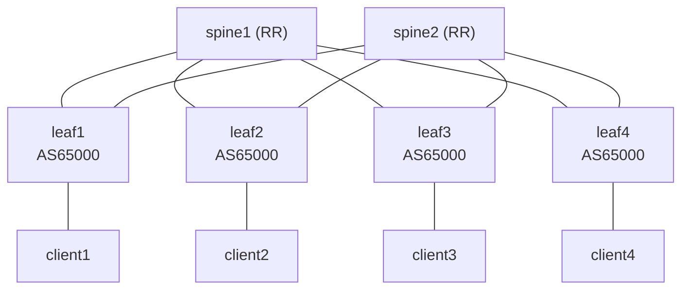

# Production Network Testing Lab

A production-grade multi-vendor network testing lab for developing and validating datacenter automation, telemetry, and monitoring tools.

## Quick Start

```bash
# 1. Provision a Hetzner lab server (or set up .env manually)
cd terraform
cp terraform.tfvars.example terraform.tfvars   # edit if needed
./create-lab.sh                                 # creates server + generates .env
cd ..

# 2. Set up the remote server
./scripts/lab setup

# 3. Deploy the network lab
./scripts/lab deploy              # SR Linux (default)
./scripts/lab deploy sonic        # or SONiC

# 4. Configure the fabric
./scripts/lab configure

# 5. Validate
./scripts/lab validate

# 6. Access monitoring dashboards
./scripts/lab tunnel
# Grafana: http://localhost:3000  Prometheus: http://localhost:9090

# Tear down the server when done
cd terraform && ./destroy-lab.sh
```

## Documentation

Complete documentation is organized in the `docs/` directory:

- **[Documentation Index](docs/README.md)** - Complete documentation overview
- **[Getting Started](docs/user/setup.md)** - Initial setup and deployment
- **[Lab Operations](docs/user/LAB-RESTART-GUIDE.md)** - Day-to-day lab management
- **[Configuration Guide](docs/user/configuration.md)** - Network configuration
- **[Monitoring Guide](docs/user/monitoring.md)** - Telemetry and dashboards
- **[Troubleshooting](docs/user/troubleshooting.md)** - Common issues and solutions
- **[Developer Guide](docs/developer/contributing.md)** - Contributing and testing
- **[Architecture](docs/developer/architecture.md)** - System design and components
- **[Multi-Vendor Deployment](docs/MULTI-VENDOR-DEPLOYMENT.md)** - Multi-vendor setup guide

## Overview

This lab provides a production-grade datacenter network with:
- **Multi-vendor support** for SR Linux, Arista EOS, SONiC, and Juniper
- **OSPF underlay** for fast convergence and next-hop reachability
- **iBGP overlay** with route reflectors for application routing and EVPN
- **EVPN/VXLAN fabric** for L2 overlay across the CLOS topology
- **Separate monitoring stack** that persists across network lab rebuilds
- **Ansible automation** with multi-vendor dispatcher pattern via gNMI
- **OpenConfig telemetry** for vendor-neutral monitoring
- **All tools designed for production datacenter use** - only difference is containerized vs physical hardware

## Architecture

### Network Topology



### Topologies

- **`topologies/topology-srlinux.yml`** - SR Linux single-vendor CLOS (default)
- **`topologies/topology-multi-vendor.yml`** - Multi-vendor CLOS (SR Linux, Arista cEOS, SONiC, Juniper cRPD)
- **`topologies/topology-monitoring.yml`** - Monitoring stack (Grafana, Prometheus, gNMIc)

### Components

**Network Lab** (`topologies/topology-srlinux.yml`):
- 2 Spine switches (SR Linux, route reflectors)
- 4 Leaf switches (SR Linux)
- 4 Client nodes (netshoot, EVPN/VXLAN bridged on 10.10.100.0/24)

**Multi-Vendor Lab** (`topologies/topology-multi-vendor.yml`):
- SR Linux spine + Arista cEOS spine
- SR Linux leaf + Arista cEOS leaf + SONiC leaf + Juniper cRPD leaf
- 4 Client nodes

**Monitoring Stack** (`topologies/topology-monitoring.yml` - separate):
- Grafana: http://localhost:3000 (admin/admin)
- Prometheus: http://localhost:9090
- gNMIc: http://localhost:9273/metrics

**Management Network:**
- 172.20.20.0/24 (shared between network and monitoring)
- Spines: 172.20.20.10-11
- Leafs: 172.20.20.21-24
- Clients: 172.20.20.31-34
- Monitoring: 172.20.20.2 (Grafana), 172.20.20.3 (Prometheus), 172.20.20.5 (gNMIc)

## Deployment

### Infrastructure (Hetzner Cloud)

Terraform provisions a lab server on Hetzner Cloud. The config supports multiple clouds via modules but only Hetzner is implemented.

```bash
cd terraform
cp terraform.tfvars.example terraform.tfvars   # edit server_type, location, etc.
./create-lab.sh [srlinux|sonic]                # provisions server + generates .env
./destroy-lab.sh                               # tears everything down
```

Available server types (from `hcloud server-type list`):
- `cpx31` — 4 vCPU, 8 GB (default, good for single-vendor)
- `cpx41` — 8 vCPU, 16 GB (recommended for multi-vendor)
- `cpx51` — 16 vCPU, 32 GB (stress testing)

Locations: `ash` (Ashburn, VA), `hil` (Hillsboro, OR), `nbg1` (Nuremberg), `hel1` (Helsinki), `fsn1` (Falkenstein)

If a location is out of capacity, override: `terraform apply -auto-approve -var="location=hel1"`

The `HCLOUD_TOKEN` is read automatically from `~/.config/hcloud/cli.toml` (set up via `hcloud context create`).

### Network Lab

```bash
./scripts/lab deploy              # default vendor (from .env)
./scripts/lab deploy srlinux      # SR Linux topology
./scripts/lab deploy sonic        # SONiC topology
./scripts/lab destroy             # tear down topology
./scripts/lab status              # show running containers
```

### Configuration

```bash
./scripts/lab configure                                              # run default site playbook
./scripts/lab configure ansible/methods/srlinux_gnmi/site.yml        # specific playbook
```

### Monitoring

Monitoring is included in the topology. Access via SSH tunnels:

```bash
./scripts/lab tunnel
# Grafana:    http://localhost:3000 (admin/admin)
# Prometheus: http://localhost:9090
# gNMIc:     http://localhost:9273/metrics
```

## Ansible Automation

The Ansible roles and playbooks are published as a standalone collection: [`netgnmi.dcfabric`](https://github.com/twbowman/ansible-collection-netgnmi-dcfabric). Install with:

```bash
ansible-galaxy collection install git+https://github.com/twbowman/ansible-collection-netgnmi-dcfabric.git
```

### Multi-Vendor Dispatcher Pattern

The main `site.yml` uses a dispatcher pattern that routes configuration to vendor-specific roles based on `ansible_network_os`. Supported vendors:
- **Nokia SR Linux** (`nokia.srlinux` / `srlinux`)
- **Arista EOS** (`arista.eos` / `eos`)
- **SONiC** (`dellemc.sonic` / `sonic`)
- **Juniper** (`juniper.junos` / `junos`)

### Configuration Methods

- **srlinux_gnmi** (`methods/srlinux_gnmi/`) - Uses gnmic CLI with native SR Linux YANG paths
- **OpenConfig** (`site-openconfig.yml`) - Uses OpenConfig YANG models for vendor-neutral config

**Why native paths for SR Linux?** SR Linux only supports OpenConfig for read operations (monitoring). Configuration requires native SR Linux YANG paths.

### Playbooks

```bash
cd ansible

# Full configuration via dispatcher (interfaces → LLDP → OSPF → BGP → EVPN)
ansible-playbook -i inventory.yml site.yml

# OpenConfig-based configuration
ansible-playbook -i inventory.yml site-openconfig.yml

# SR Linux gNMI method directly
ansible-playbook methods/srlinux_gnmi/site.yml

# Individual components
ansible-playbook methods/srlinux_gnmi/playbooks/configure-interfaces.yml
ansible-playbook methods/srlinux_gnmi/playbooks/configure-lldp.yml
ansible-playbook methods/srlinux_gnmi/playbooks/configure-bgp.yml
ansible-playbook methods/srlinux_gnmi/playbooks/configure-evpn.yml

# Verification
ansible-playbook methods/srlinux_gnmi/playbooks/verify.yml
ansible-playbook methods/srlinux_gnmi/playbooks/verify-detailed.yml
ansible-playbook methods/srlinux_gnmi/playbooks/verify-evpn.yml

# Validation playbooks (shared)
ansible-playbook playbooks/validate.yml
ansible-playbook playbooks/validate-bgp.yml
ansible-playbook playbooks/validate-interfaces.yml
ansible-playbook playbooks/validate-lldp.yml
ansible-playbook playbooks/validate-evpn.yml
ansible-playbook playbooks/validate-client-lldp.yml

# Use tags
ansible-playbook -i inventory.yml site.yml --tags interfaces
ansible-playbook -i inventory.yml site.yml --tags ospf
ansible-playbook -i inventory.yml site.yml --tags bgp
ansible-playbook -i inventory.yml site.yml --tags evpn
```

### Roles

**SR Linux gNMI roles** (`methods/srlinux_gnmi/roles/`):
- `gnmi_system` - System configuration
- `gnmi_interfaces` - Interface and IP configuration
- `gnmi_lldp` - LLDP neighbor discovery
- `gnmi_ospf` - OSPF underlay routing
- `gnmi_bgp` - BGP overlay routing
- `gnmi_evpn_vxlan` - EVPN/VXLAN fabric overlay
- `gnmi_static_routes` - Static route configuration

**Vendor-specific roles** (`roles/`):
- Arista EOS: `eos_interfaces`, `eos_ospf`, `eos_bgp`, `eos_evpn_vxlan`
- Juniper: `junos_interfaces`, `junos_ospf`, `junos_bgp`, `junos_evpn_vxlan`
- SONiC: `sonic_interfaces`, `sonic_ospf`, `sonic_bgp`, `sonic_evpn_vxlan`
- OpenConfig: `openconfig_interfaces`, `openconfig_lldp`, `openconfig_ospf`, `openconfig_bgp`

**Utility roles** (`roles/`):
- `config_validation` - Pre-deployment configuration syntax validation
- `config_rollback` - Configuration state capture and rollback

See `ansible/README.md` and `ansible/methods/srlinux_gnmi/README.md` for details.

## Monitoring

### Telemetry Collection

gNMIc collects from all switches using a two-tier approach:

**Tier 1 - OpenConfig (vendor-neutral):**
- Interface statistics and state (10s interval)
- BGP neighbor state (30s)
- LLDP neighbors (60s)
- QoS queue statistics (10s)

**Tier 2 - SR Linux native (vendor-specific):**
- OSPF neighbor state (30s)
- EVPN operational state (30s)
- VXLAN tunnel state and bridge table stats (30s)

All metrics are normalized to vendor-neutral names (e.g., `network_interface_in_octets`, `network_bgp_session_state`) via gNMIc event processors.

### Data Storage

Prometheus stores metrics:
- 30-day retention
- 10-second scrape interval
- PromQL queries available

### Visualization

Grafana dashboards:
- Universal Interfaces - Cross-vendor interface performance
- Universal BGP - BGP session state and statistics
- Universal LLDP - LLDP neighbor topology
- Interface Performance - Detailed interface metrics
- BGP Stability - BGP session health monitoring
- OSPF Stability - OSPF adjacency monitoring
- Network Congestion Analysis - Queue depth and drops
- EVPN/VXLAN Stability - VXLAN tunnel and MAC table health
- Vendor SR Linux - SR Linux specific metrics

Access Grafana at http://localhost:3000 (admin/admin)

## Traffic Testing

Ansible-based fabric load testing using iperf3 across all client nodes via EVPN/VXLAN.

All 4 clients share the same L2 subnet (10.10.100.0/24) bridged across the fabric via mac-vrf-100 (VNI 10100). Traffic between clients on different leafs traverses the full leaf-spine-leaf VXLAN path.

```bash
# Quick 30-second validation
ansible-playbook -i traffic-testing/inventory.yml traffic-testing/playbooks/quick-test.yml

# Full 5-minute mesh test
ansible-playbook -i traffic-testing/inventory.yml traffic-testing/playbooks/full-mesh-traffic.yml

# Stress test
ansible-playbook -i traffic-testing/inventory.yml traffic-testing/playbooks/stress-test.yml
```

See [Traffic Testing README](traffic-testing/README.md) for details.

## Verification

### Check Network Lab

```bash
./scripts/lab status
./scripts/lab exec "docker exec clab-gnmi-clos-spine1 sr_cli 'show network-instance default protocols ospf neighbor'"
./scripts/lab exec "docker exec clab-gnmi-clos-spine1 sr_cli 'show network-instance default protocols bgp neighbor'"
./scripts/lab exec "docker exec clab-gnmi-clos-client1 ping -c 3 10.10.100.12"
```

### Check Monitoring

```bash
./scripts/lab exec "curl -s http://localhost:9273/metrics | head -20"
./scripts/lab exec "curl -s http://localhost:9090/api/v1/targets | jq"
```

### Validation

```bash
./scripts/lab validate
```

## Prerequisites

### Local Machine (macOS / Linux)
- SSH key pair (`ssh-keygen -t ed25519`)
- rsync (pre-installed on macOS)
- Terraform >= 1.5 (for server provisioning)
- Hetzner Cloud account + `hcloud` CLI (`brew install hcloud`)

### Remote Server (provisioned by Terraform)
Everything is installed automatically by `./scripts/lab setup`:
- Docker, containerlab, gNMIc, Ansible, Python dependencies

All lab commands run on the remote server via the `./scripts/lab` wrapper script.

## Contributing

See [Developer Guide](docs/developer/contributing.md) for information on:
- Development setup
- Running tests
- CI/CD pipeline
- Code standards
- Submitting changes

### Code Quality

This project uses a 3-stage CI pipeline and pre-commit hooks:

**Pre-commit hooks (run locally before every commit):**
```bash
pip install pre-commit
pre-commit install
```

Hooks include lint (Ruff, Mypy, yamllint, ShellCheck) and local security checks (gitleaks for 150+ secret patterns, bandit, detect-private-key, large file guard).

**CI Pipeline** (`.github/workflows/ci.yml`):
1. Lint: Ruff, Mypy, yamllint, ShellCheck, ansible-lint
2. Security: Bandit, Trivy, Checkov, Gitleaks
3. Tests: Unit + Property-based (only after stages 1-2 pass)

**Tests:**
```bash
# Unit tests
pytest tests/unit/

# Property-based tests
pytest tests/property/

# Integration tests (requires running lab)
pytest tests/integration/

# All pre-commit checks
pre-commit run --all-files

# Full linter suite
./scripts/run-linters.sh
```

## Troubleshooting

### Connection Issues

```bash
# Verify remote server is reachable
./scripts/lab exec "echo ok"

# Re-run server provisioning
./scripts/lab setup

# Check device logs
./scripts/lab exec "docker logs clab-gnmi-clos-spine1"

# Verify gNMI connectivity
./scripts/lab exec "gnmic -a clab-gnmi-clos-leaf1:57400 -u admin -p NokiaSrl1! --skip-verify capabilities"
```

### Ansible Issues

```bash
./scripts/lab configure ansible/methods/srlinux_gnmi/site.yml
```

See [Troubleshooting Guide](docs/user/troubleshooting.md) for more details.

## License

This project is provided as-is for educational and testing purposes.