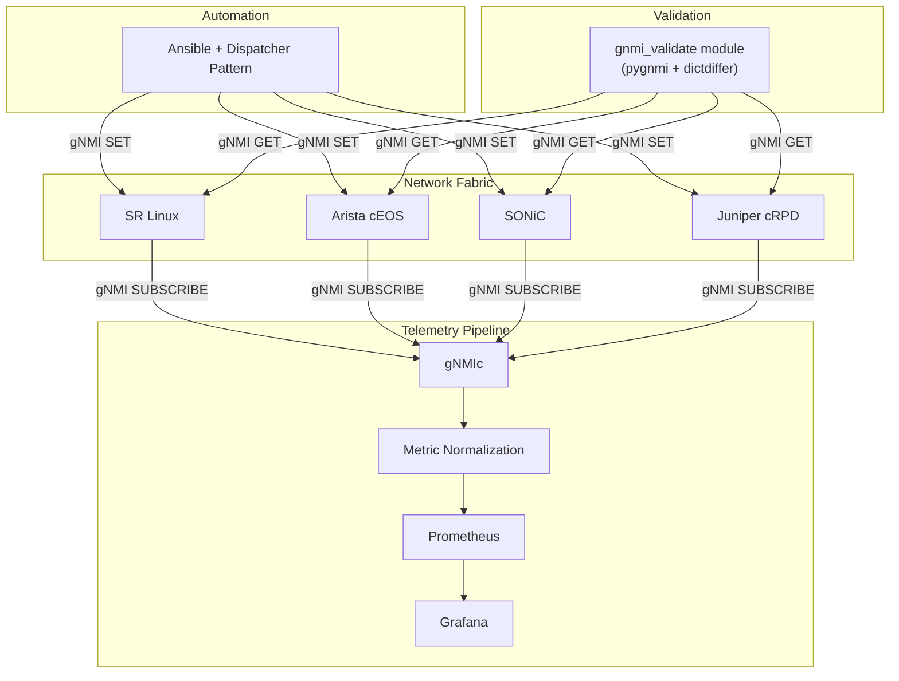

# Production Network Testing Lab — Presentation Guide

## Elevator Pitch (30 seconds)

This is a production-grade datacenter network lab that lets you deploy, configure, monitor, and validate multi-vendor network fabrics using containerized switches. Everything built here — the Ansible playbooks, Grafana dashboards, telemetry pipelines, validation checks — works identically in production. The only thing that changes is the inventory file.

---

## Suggested Flow (~30-45 minutes)

### 1. The Problem (3 min)

- Datacenter network automation is fragmented: every vendor has its own CLI, API, data models, and metric formats
- Testing network changes in production is risky — no safe place to iterate
- Monitoring across vendors requires vendor-specific dashboards and queries
- Configuration validation is manual and error-prone
- Existing platforms that integrate these functions are typically vendor-locked, proprietary, or require significant infrastructure investment

**Key question to pose**: "How do you test a BGP configuration change across 4 different vendor types before pushing to production?"

### 2. Unmet Needs in the Market (3 min)

This project isn't a new tool — it's a working, integrated, open-source reference architecture that fills gaps the industry hasn't addressed well:

- **Multi-vendor gNMI automation with a unified pattern.** Most teams use vendor CLIs, vendor-specific APIs, or NETCONF. gNMI adoption for configuration (not just telemetry) is still early, and there's very little reference material showing how to do it across 4 vendors with a single dispatcher pattern. Vendor docs show single-vendor examples. This project shows the cross-vendor reality — including the ugly parts like SR Linux rate limits and OpenConfig gaps.

- **Telemetry normalization across vendors.** Everyone talks about "vendor-neutral monitoring" but the actual work of mapping vendor-specific metric names to universal names barely exists as reusable, documented examples. The gNMIc normalization pipeline here is a practical reference implementation.

- **Validation as code, not just configuration as code.** The industry has embraced config-as-code (Ansible, Terraform, Nornir), but validation is still mostly "SSH in and check." The `gnmi_validate` module compares gNMI GET state against expected state from inventory variables, with structured diffs and remediation hints — a pattern most teams haven't built yet.

- **A laptop-runnable multi-vendor lab that mirrors production.** Containerlab made this possible, but most examples are single-vendor or topology-only. A full stack — deploy, configure, monitor, validate — running on macOS ARM with real NOS containers, where the same playbooks work in production by swapping an inventory file, is a reference architecture people are looking for and not finding.

**Positioning note**: This project isn't competing with CloudVision, Apstra, or NSO. It's showing what's possible with open-source tools and gNMI when you put the integration work in. The individual tools (Ansible, Grafana, Prometheus, gNMIc) aren't novel — the integration across vendors is.

### 3. What This Project Is (3 min)

A containerized datacenter network running real network operating systems:

- 2 spine switches (route reflectors) + 4 leaf switches + 4 clients
- Full CLOS fabric with OSPF underlay, iBGP overlay, EVPN/VXLAN
- 4 vendor support: Nokia SR Linux, Arista cEOS, SONiC, Juniper cRPD
- Runs on a laptop via Containerlab + OrbStack (macOS ARM)

**Demo opportunity**: Show `./lab start` and `./lab status` — containers come up in ~2 minutes.

### 4. Architecture Walkthrough (5 min)



Key points to highlight:
- gNMI is the single transport for config, telemetry, and validation
- OpenConfig for telemetry (vendor-neutral), native YANG for config (full feature access)
- Ansible dispatcher pattern auto-routes to vendor-specific roles based on OS detection
- Everything is infrastructure-as-code, version controlled

### 5. Multi-Vendor Dispatcher Pattern (5 min)

This is the core automation innovation. Walk through how it works:

1. Dynamic inventory queries gNMI capabilities from each device
2. OS is detected automatically (srlinux, eos, sonic, junos)
3. `site.yml` uses conditionals to route to vendor-specific roles
4. Same playbook, same variables, different vendors

```yaml
# One playbook handles all vendors
- name: Configure SR Linux
  include_role: { name: gnmi_interfaces }
  when: ansible_network_os == 'nokia.srlinux'

- name: Configure Arista
  include_role: { name: eos_interfaces }
  when: ansible_network_os == 'arista.eos'
```

**Demo opportunity**: Run `ansible-playbook -i inventory.yml site.yml` and show it configuring interfaces → LLDP → OSPF → BGP → EVPN across all devices.

### 6. EVPN/VXLAN Fabric (5 min)

Explain the overlay architecture:
- OSPF provides underlay reachability between loopbacks
- iBGP with route reflectors (spines) distributes EVPN routes
- VXLAN tunnels extend L2 domains across the fabric
- 5 tenant VLANs mapped to VNIs (10010-10050), 2 L3 VRFs

Data model is in `group_vars/leafs.yml` — change the YAML, re-run the playbook, fabric reconfigures.

**Demo opportunity**: `docker exec clab-gnmi-clos-client1 ping 10.10.100.12` — traffic traverses leaf1 → spine → leaf2 via VXLAN.

### 7. Telemetry and Monitoring (5 min)

Two-tier telemetry approach:
- Tier 1: OpenConfig paths for vendor-neutral metrics (interfaces, BGP, LLDP)
- Tier 2: Native vendor paths for features OpenConfig doesn't cover (OSPF, EVPN)

Metric normalization pipeline:
- gNMIc collects via gNMI SUBSCRIBE
- Event processors transform vendor-specific names → universal names
- `network_interface_in_octets` works whether the device is SR Linux, Arista, or Juniper

9 Grafana dashboards, all using normalized metrics:
- Universal Interfaces, Universal BGP, Universal LLDP
- Interface Performance, BGP Stability, OSPF Stability
- Network Congestion, EVPN/VXLAN Stability
- Vendor SR Linux (native metrics drill-down)

**Demo opportunity**: Open Grafana at localhost:3000, show the Universal Interfaces dashboard with data from all devices. Then drill into vendor-specific view.

### 8. Validation Framework (5 min)

Custom `gnmi_validate` Ansible module:
- Uses pygnmi to query device state via gNMI GET
- Compares actual state against expected state from inventory variables
- Supports both OpenConfig and vendor-native YANG via the `origin` field
- Returns structured pass/fail with diffs and remediation hints

Validation playbooks:
- `validate-bgp.yml` — all BGP sessions ESTABLISHED?
- `validate-evpn.yml` — EVPN routes advertised and received?
- `validate-lldp.yml` — LLDP neighbors match topology?
- `validate-interfaces.yml` — interfaces oper-up match expected?

Callback plugin aggregates results into a JSON report.

**Demo opportunity**: Run `ansible-playbook playbooks/validate.yml`, show the structured output. Then intentionally break something (shut an interface) and re-run to show failure detection with remediation suggestions.

### 9. Production Portability (3 min)

This is the key differentiator. Everything built here transfers directly to production:

| Component | Lab | Production | What Changes |
|-----------|-----|------------|--------------|
| Ansible playbooks | Same | Same | Nothing |
| Grafana dashboards | Same | Same | Nothing |
| gNMI subscriptions | Same | Same | Nothing |
| Validation checks | Same | Same | Nothing |
| Inventory file | containerlab IPs | datacenter IPs | Only this |

Migration path: develop in lab → validate → update inventory → run same playbook against production.

### 10. Engineering Challenges (3 min)

Interesting problems solved along the way:

- **SR Linux gNMI rate limit**: 60 connections/minute per device. Solved by batching all gNMI SET operations into single calls with multiple update-path/update-value pairs using Jinja2 loops. Reduced ~50 connections per host to ~15.

- **OpenConfig gaps**: SR Linux doesn't expose OSPF or EVPN via OpenConfig. Solution: dual-schema approach using the gNMI `origin` field — OpenConfig for telemetry, native YANG for config and vendor-specific validation.

- **Metric normalization at scale**: 4 vendors × different path formats × different naming conventions. Built a normalization pipeline in gNMIc that produces identical metric names regardless of source vendor.

### 11. Building with AI (3 min)

This project was built in partnership with an AI coding assistant (Kiro). Worth discussing how AI changes the game for network automation projects like this:

- **Cross-domain knowledge on tap.** This project spans Ansible, gNMI, YANG models, 4 vendor CLIs, Jinja2, Python, Prometheus, Grafana, Docker, and Containerlab. No single engineer is an expert in all of these. AI bridges the knowledge gaps in real time — you don't have to context-switch between vendor documentation tabs.

- **Faster iteration on vendor-specific quirks.** Discovering that SR Linux enforces a 60 conn/min gNMI rate limit, understanding why, and rewriting 5 roles to batch operations — that research-and-refactor cycle happened in a single session instead of days of trial-and-error with vendor docs and support tickets.

- **Documentation that stays current.** Every code change was immediately followed by documentation updates — steering files for AI context, troubleshooting guides for humans, README updates. AI makes "document as you go" nearly free, which means docs don't rot.

- **Spec-driven development.** Complex features (telemetry normalization, validation framework, EVPN/VXLAN) were built using structured specs — requirements → design → tasks — with AI helping refine each stage before writing code. This catches design issues before they become code issues.

- **Honest feedback loop.** AI can challenge assumptions — like pointing out that "no platform ties these together" is a claim that won't survive audience scrutiny. That kind of review normally requires a colleague who knows the space.

**Key takeaway**: AI didn't replace the network engineering expertise needed to design this architecture. It amplified the ability to execute across multiple technology domains simultaneously, and dramatically reduced the time from idea to working implementation.

### 12. CI/CD and Testing (2 min)

3-stage GitHub Actions pipeline:
1. Lint: Ruff, Mypy, yamllint, ShellCheck, ansible-lint
2. Security: Bandit, Trivy, Checkov, Gitleaks
3. Tests: Unit + Property-based (Hypothesis)

Pre-commit hooks enforce all lint + security checks locally before push.

Test structure:
- Unit tests: deployment, configuration, telemetry, validation, state management
- Property-based tests: state management invariants, telemetry properties
- Integration tests: end-to-end workflows, multi-vendor, monitoring stack

### 13. Live Demo Sequence (optional, 10 min)

If doing a live demo, suggested order:

```bash
# 1. Show the topology
cat topology.yml

# 2. Deploy (if not already running)
./lab start

# 3. Show running containers
./lab status

# 4. Configure the fabric
orb -m clab ansible-playbook -i ansible/inventory.yml ansible/methods/srlinux_gnmi/site.yml

# 5. Verify OSPF + BGP
orb -m clab docker exec clab-gnmi-clos-spine1 sr_cli "show network-instance default protocols ospf neighbor"
orb -m clab docker exec clab-gnmi-clos-spine1 sr_cli "show network-instance default protocols bgp neighbor"

# 6. Test client connectivity via EVPN/VXLAN
orb -m clab docker exec clab-gnmi-clos-client1 ping -c 3 10.10.100.12

# 7. Show Grafana dashboards
open http://localhost:3000

# 8. Run validation
orb -m clab ansible-playbook -i ansible/inventory.yml ansible/playbooks/validate.yml

# 9. Break something and re-validate
orb -m clab docker exec clab-gnmi-clos-leaf1 sr_cli "set /interface ethernet-1/1 admin-state disable"
orb -m clab ansible-playbook -i ansible/inventory.yml ansible/playbooks/validate.yml
# Show failure detection + remediation hint

# 10. Fix it
orb -m clab docker exec clab-gnmi-clos-leaf1 sr_cli "set /interface ethernet-1/1 admin-state enable"
```

---

## Key Numbers

| Metric | Value |
|--------|-------|
| Vendors supported | 4 (SR Linux, Arista, SONiC, Juniper) |
| Network devices | 6 (2 spines + 4 leafs) |
| Client nodes | 4 |
| Ansible roles | 26 (7 SR Linux gNMI + 4×3 vendor + 4 OpenConfig + 2 utility) |
| Grafana dashboards | 9 |
| Telemetry metrics | ~1,560 OpenConfig + native |
| Validation checks | 5 categories (BGP, EVPN, LLDP, interfaces, client-LLDP) |
| CI pipeline stages | 3 (lint, security, tests) |
| Tenant VLANs | 5 (VNI 10010-10050) |
| L3 VRFs | 2 (tenant-a, tenant-b) |

## Anticipated Questions

**Q: Why not just use Terraform/Nornir/Napalm?**
A: Those tools focus on config management. This project is a complete platform — deployment, config, telemetry, monitoring, and validation in one integrated stack. Ansible was chosen because it's the most widely adopted in network operations teams.

**Q: Why gNMI instead of NETCONF/RESTCONF?**
A: gNMI provides streaming telemetry (not just config), uses efficient gRPC/protobuf transport, and is the direction the industry is moving. One protocol for config SET, state GET, and telemetry SUBSCRIBE.

**Q: Does this scale to production?**
A: Yes. The Ansible playbooks, Grafana dashboards, and gNMI subscriptions are identical between lab and production. Prometheus and gNMIc support horizontal scaling. The only change is the inventory file.

**Q: Why OpenConfig for telemetry but native YANG for config?**
A: OpenConfig telemetry gives us vendor-neutral dashboards. But OpenConfig config support is incomplete — SR Linux doesn't support EVPN via OpenConfig, for example. Native YANG gives full feature access for configuration.

**Q: What about the SR Linux rate limit issue?**
A: SR Linux enforces 60 gNMI connections/minute for CPU protection. We batch all operations into single gnmic calls using Jinja2 loops with multiple update-path/update-value pairs. Reduced from ~50 to ~15 connections per host.
