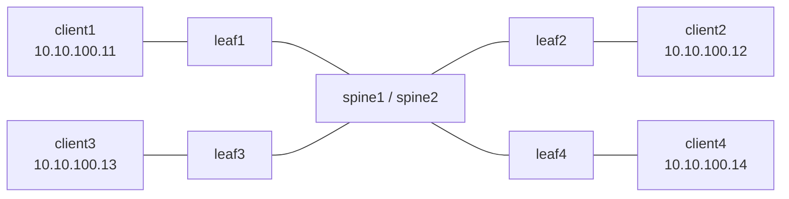

# Traffic Testing

Ansible-based fabric load testing using iperf3. Separate inventory and playbooks from network switch management.

## Architecture

All 4 clients sit on the same L2 subnet (10.10.100.0/24) bridged across the EVPN/VXLAN fabric (mac-vrf-100, VNI 10100). Traffic between any two clients traverses leaf → spine → leaf via VXLAN encapsulation, creating a full mesh of 12 bidirectional flows through the CLOS fabric.



All clients share 10.10.100.0/24 via EVPN/VXLAN (VNI 10100).
Traffic path: client → leaf → VXLAN encap → spine → leaf → VXLAN decap → client.

## Prerequisites

- Network lab deployed and configured (OSPF + BGP + EVPN)
- mac-vrf-100 with VNI 10100 configured on all leafs
- Bridged subinterface ethernet-1/3.0 on each leaf
- `community.docker` Ansible collection installed

## Quick Start

```bash
# Quick 30-second validation
orb -m clab ansible-playbook -i traffic-testing/inventory.yml traffic-testing/playbooks/quick-test.yml

# Full 5-minute mesh test (default)
orb -m clab ansible-playbook -i traffic-testing/inventory.yml traffic-testing/playbooks/full-mesh-traffic.yml

# Stress test - 8 streams per pair, 20M/stream
orb -m clab ansible-playbook -i traffic-testing/inventory.yml traffic-testing/playbooks/stress-test.yml
```

## Playbooks

| Playbook | Duration | Streams | Bandwidth | Purpose |
|----------|----------|---------|-----------|---------|
| `quick-test.yml` | 30s | 2 | 10M/stream | Fast validation |
| `full-mesh-traffic.yml` | 5min | 4 | 10M/stream | Standard load test |
| `stress-test.yml` | 5min | 8 | 20M/stream | Find congestion limits |

## What the Playbook Does

1. Verifies iperf3 availability and full mesh ping connectivity
2. Kills any existing iperf3 processes
3. Starts iperf3 servers on each client (one per source, unique ports)
4. Launches iperf3 UDP clients for all 12 pairs simultaneously
5. Waits for the test duration to complete
6. Collects and parses JSON results (throughput, jitter, packet loss)
7. Cleans up all iperf3 processes

## Overrides

All parameters can be overridden at runtime:

```bash
# Custom duration
orb -m clab ansible-playbook -i traffic-testing/inventory.yml \
  traffic-testing/playbooks/full-mesh-traffic.yml -e iperf3_duration=120

# More streams
orb -m clab ansible-playbook -i traffic-testing/inventory.yml \
  traffic-testing/playbooks/full-mesh-traffic.yml -e iperf3_parallel_streams=16

# Custom bandwidth per stream
orb -m clab ansible-playbook -i traffic-testing/inventory.yml \
  traffic-testing/playbooks/full-mesh-traffic.yml -e iperf3_bandwidth=5M

# TCP mode instead of UDP (may have issues with VXLAN MTU)
orb -m clab ansible-playbook -i traffic-testing/inventory.yml \
  traffic-testing/playbooks/full-mesh-traffic.yml -e iperf3_udp=false
```

## Monitoring During Tests

Run traffic tests while watching the Grafana dashboards at http://localhost:3000:

- **Network Congestion Analysis** - Dropped packets, queue depth, interface utilization
- **Network Interface Performance** - Throughput and error rates across all interfaces
- **EVPN/VXLAN Stability** - VXLAN tunnel status and MAC table entries
- **BGP Stability** - BGP session health during load
- **OSPF Stability** - OSPF adjacency health during load

## Client Layout

| Client | IP | Leaf | Gateway | Container |
|--------|-----|------|---------|-----------|
| client1 | 10.10.100.11/24 | leaf1 (e1/3) | VXLAN bridged | clab-gnmi-clos-client1 |
| client2 | 10.10.100.12/24 | leaf2 (e1/3) | VXLAN bridged | clab-gnmi-clos-client2 |
| client3 | 10.10.100.13/24 | leaf3 (e1/3) | VXLAN bridged | clab-gnmi-clos-client3 |
| client4 | 10.10.100.14/24 | leaf4 (e1/3) | VXLAN bridged | clab-gnmi-clos-client4 |

## Network Configuration

The client-facing setup on each leaf:

- `ethernet-1/3` - untagged, no VLAN tagging
- `ethernet-1/3.0` - bridged subinterface
- `mac-vrf-100` - MAC-VRF network instance with EVPN/VXLAN
- `vxlan1.10100` - VXLAN interface (VNI 10100)
- BGP-EVPN instance with route targets `65000:10100`
- IMET and MAC-IP route advertisement enabled

## Known Limitations

- **MTU**: SR Linux containerlab XDP datapath limits VXLAN inner MTU to ~1450 bytes. Client MTU is set to 1400 and iperf3 uses 1300-byte UDP packets to stay within this limit.
- **TCP through VXLAN**: TCP iperf3 has MSS/MTU issues in the emulated environment. UDP mode is used by default.
- **Throughput**: Emulated environment (ARM Mac + ORB + x86 emulation) limits achievable throughput. Focus on relative load distribution across the fabric rather than absolute numbers.
- **iperf3 single-client**: Each iperf3 server instance handles one client at a time. The playbook uses unique ports per source client to work around this.

## Production Use

This same approach works in production with real hardware:
- Replace `community.docker.docker` connection with SSH or similar
- Update inventory with real host IPs
- Remove MTU workarounds (real hardware supports jumbo frames through VXLAN)
- Enable TCP mode for more realistic traffic patterns
- Increase bandwidth targets to match link speeds
